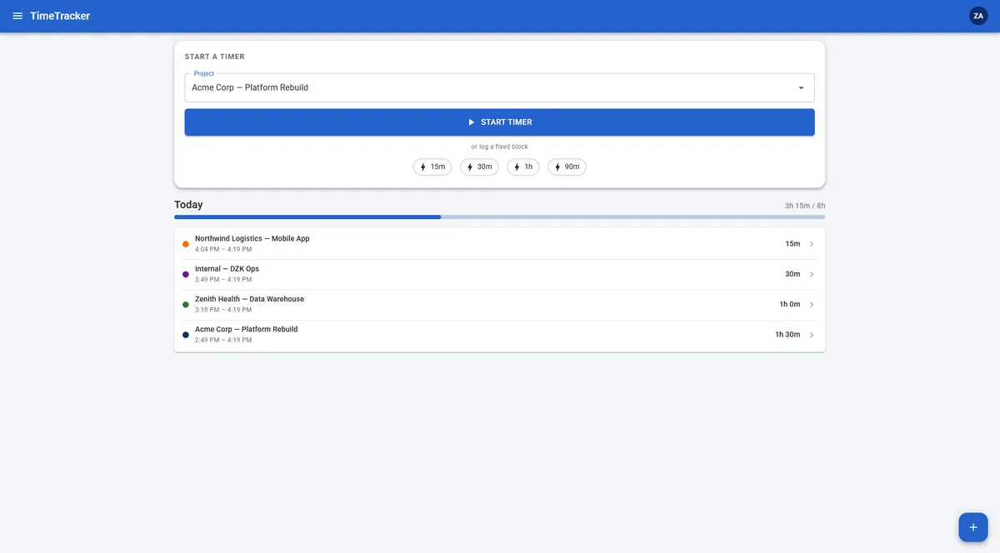

# TimeTracker

A personal timesheeting application for tracking time entries against projects, with year-view reporting and planned Zoho Books integration for invoice generation.

## Tech stack

- **[.NET 10](https://dotnet.microsoft.com/)** — ASP.NET Core + Blazor WebAssembly
- **[Entity Framework Core](https://learn.microsoft.com/en-us/ef/core/)** — SQL Server via EF Core
- **[ASP.NET Core Identity](https://learn.microsoft.com/en-us/aspnet/core/security/authentication/identity)** — user management
- **[MudBlazor](https://mudblazor.com/)** — UI component library

## Live showcase

A read-only showcase with mock data is hosted on GitHub Pages:
**[https://zkarachiwala.github.io/TimeTracker/](https://zkarachiwala.github.io/TimeTracker/)**

[](https://zkarachiwala.github.io/TimeTracker/)

## Running locally

### Prerequisites

- [.NET 10 SDK](https://dotnet.microsoft.com/download)
- [Docker Desktop](https://www.docker.com/products/docker-desktop/)

### 1. Start SQL Server

```bash
docker run \
  -e "ACCEPT_EULA=Y" \
  -e "MSSQL_SA_PASSWORD=YourStrong@Passw0rd" \
  -p 1435:1433 \
  --name timetracker-sql \
  -d mcr.microsoft.com/mssql/server:2022-latest
```

> Port 1435 is used because 1433 and 1434 are reserved by the Windows SQL Server instance.
> Connect via SSMS using `127.0.0.1,1435`, SQL auth (sa), with `Encrypt=false;TrustServerCertificate=true` in Additional Connection Parameters.

### 2. Set user secrets

```bash
cd TimeTracker.Web
dotnet user-secrets set "DbUser" "sa"
dotnet user-secrets set "DbPassword" "YourStrong@Passw0rd"
```

### 3. Apply database migrations

```bash
cd TimeTracker.Web
dotnet ef database update --context TimeTrackerDataContext
dotnet ef database update --context IdentityDataContext
```

### 4. Activate git hooks (once per clone)

```bash
git config core.hooksPath .githooks
```

This enables the pre-push hook, which runs the full Playwright test suite automatically before every push when app code has changed. The hook exists because there is no staging environment — authenticated E2E tests cannot run in CI against production, so the pre-push hook is the gate. See [D016](docs/decisions.md#d016-playwright--full-suite-pre-push-ci-smoke-test-only) for the full decision including how this changes if a staging environment is added.

### 5. Run

```bash
cd TimeTracker.Web
dotnet run
```

App: `https://localhost:7006`
API docs (dev only): `https://localhost:7006/scalar/v1`

## Testing

### Unit tests

```bash
dotnet test TimeTracker.Tests
```

### Playwright E2E tests

```bash
dotnet test TimeTracker.Playwright
```

The app starts automatically if it isn't already running. All tests run headlessly; no manual setup required.

## Documentation

- [Architecture](docs/architecture.md) — current and future state, tech decisions
- [Roadmap](docs/roadmap.md) — phased implementation plan

## Design mockup

An interactive HTML mockup of the full app is in the [`mockup/`](mockup/) folder.  Open [`mockup/TimeTracker App.html`](mockup/TimeTracker%20App.html) in a browser to explore the intended UI — phone viewport shows the mobile layout, and the [Mockups wrapper](mockup/TimeTracker%20Mockups.html) shows both mobile and desktop side-by-side.

## Deployment

The app runs across two separate hosting targets:

| Target | URL | Purpose |
|--------|-----|---------|
| **Azure App Service F1** | [timetracker.dzk.com.au](https://timetracker.dzk.com.au) | Live app — Google OAuth, SQL Server, full functionality |
| **GitHub Pages** | [zkarachiwala.github.io/TimeTracker](https://zkarachiwala.github.io/TimeTracker/) | Read-only showcase — mock data, no login required |

Both are deployed automatically by GitHub Actions on every merge to `main` that contains code changes. The live app uses OIDC to authenticate against Azure; the showcase publishes a standalone Blazor WASM bundle compiled with `#if SHOWCASE` mock services.

## Credits

This project started as a hands-on exercise following the **[Web API, Blazor & Blazor WebAssembly Masterclass](https://dotnetwebacademy.com/courses/web-api-blazor-blazor-webassembly-masterclass)** course by .NET Web Academy. The architecture has since been significantly evolved beyond the course material — Global InteractiveWebAssembly rendering, Vertical Slice Architecture, Google OAuth, MudBlazor UI, Azure deployment with Managed Identity, a full Playwright test suite, and a GitHub Pages showcase. Most of this was learned via the academy or [Patrick God's YouTube channel](https://www.youtube.com/@PatrickGod), which I highly recommend.

## Adding EF Core migrations

```bash
cd TimeTracker.Web
dotnet ef migrations add <MigrationName> --context TimeTrackerDataContext
dotnet ef migrations add <MigrationName> --context IdentityDataContext
```
