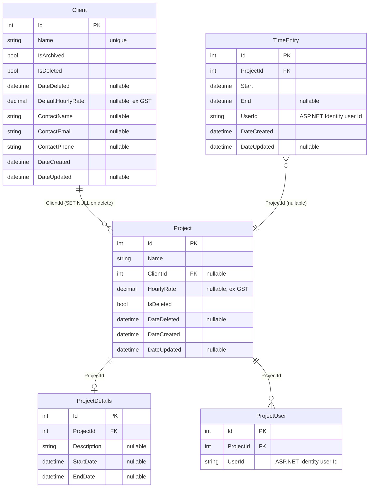
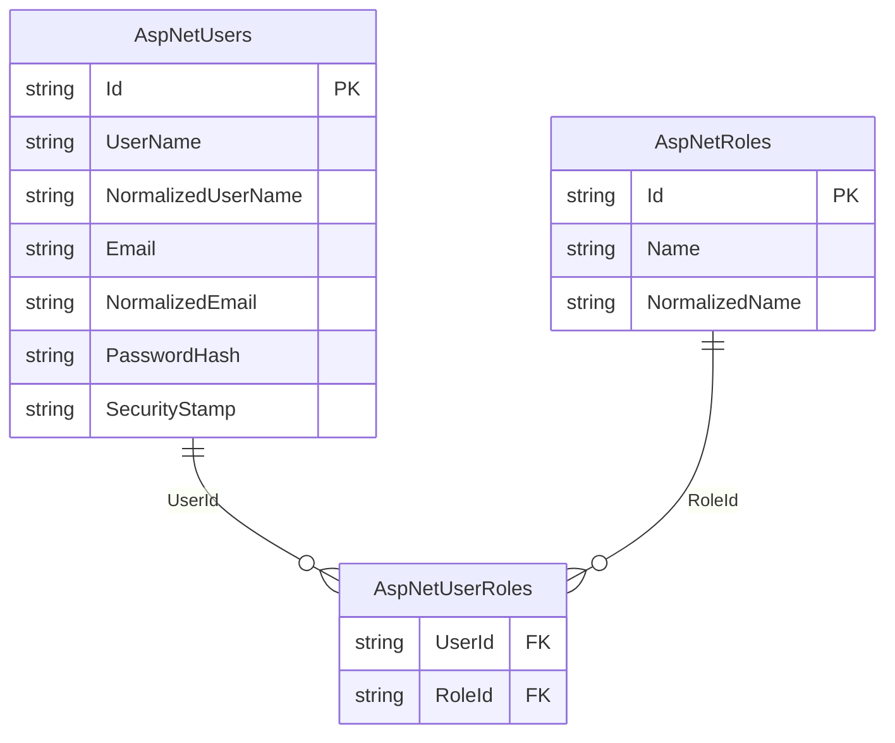

# TimeTracker — Architecture

## Overview

TimeTracker is a personal timesheeting application for tracking time entries against projects, managing clients, and year-view reporting across users.

---

## Change log

| Date | Change | PR |
|------|--------|----|
| 2026-06 | Decision: migrate hosting from App Service F1 → Azure Container Apps; migrate UI from Blazor Interactive Server → Blazor WASM | — |
| 2026-06 | Deployed to Azure App Service F1 + Azure SQL; GitHub Actions OIDC push-to-deploy | #43–45 |
| 2026-06 | Security hardening: CSP, HSTS, rate limiting on auth endpoints, 82 tests | #42 |
| 2026-05 | MudBlazor UI uplift; replaced Tailwind + Radzen + QuickGrid | #38 |
| 2026-05 | Added `Clients` table; client CRUD feature; project–client FK; 12 new tests (51 total) | #29 |
| 2026-05 | Google OAuth; removed username/password login | #28 |
| 2026-05 | Renamed `TimeTracker.API` → `TimeTracker.Web` to align with documentation | #26 |
| 2026-05 | Added `TimeTracker.Tests` — 31 service integration tests (EF InMemory); CI runs `dotnet test` on every PR | #25 |
| 2026-05 | Migrated to Blazor SSR + Vertical Slice Architecture; removed `TimeTracker.Client` | #25 |
| 2026-05 | Upgraded solution from .NET 7 → .NET 10 | #20 |
| 2026-05 | Replaced Swashbuckle with native ASP.NET Core OpenAPI + Scalar UI (dev only) | #20 |

---

## Current State

### Solution structure

```
TimeTracker.sln
├── TimeTracker.Web         — ASP.NET Core + Blazor SSR + Vertical Slice features + REST API
├── TimeTracker.Shared      — EF Core entities only (class library)
└── TimeTracker.Tests       — xUnit service integration tests (EF InMemory)
```

```
TimeTracker.Web/
  Features/
    Auth/          — Login/Logout pages, ExternalLoginService
    Clients/       — IClientService, ClientService, ClientModels, ClientEndpoints, Pages/
    Projects/      — IProjectService, ProjectService, ProjectModels, ProjectEndpoints, Pages/
    TimeEntries/   — ITimeEntryService, TimeEntryService, TimeEntryModels, TimeEntryEndpoints, Pages/
  Shared/
    IUserContextService, UserContextService
    Components/    — reusable Blazor components
    Layout/        — MainLayout, NavMenu, LoginDisplay
  Data/            — TimeTrackerDataContext, IdentityDataContext
```

### Runtime

- **.NET 10**
- Single process: Blazor Interactive Server serves pages via SignalR; REST API endpoints on the same host
- Deployed to **Azure App Service F1** with **Azure SQL Database** (free offer)
- Runs at `https://localhost:7006` (dev). API docs at `/scalar/v1` (dev only).

### Data layer

Two EF Core `DbContext`s, both targeting **SQL Server** (`TimeTrackerDb`):

| Context | Schema | Tables |
|---------|--------|--------|
| `TimeTrackerDataContext` | `app` | `Clients`, `TimeEntries`, `Projects`, `ProjectDetails`, `ProjectUsers` |
| `IdentityDataContext` | `id` | ASP.NET Identity tables |

- `Client` is shared across all users — no `UserId` scoping. `Name` has a unique index. `DefaultHourlyRate` is nullable (ex GST). Supports soft-delete (`IsDeleted`) for recoverability and archiving (`IsArchived`) to hide inactive clients from dropdowns without deleting them.
- `Project` uses soft-delete (`SoftDeleteableEntity`). `ClientId` is a nullable FK — deleting a client with active projects is blocked at the service layer; the DB cascades to `SET NULL` if bypassed.
- `TimeEntry` stores `UserId` (string) rather than a navigation property to avoid cascade delete issues
- **Mapster** handles entity ↔ DTO mapping, configured via per-feature `IRegister` classes scanned at startup

### Architecture

**Vertical Slice Architecture** — no controllers, no repository layer.

- Feature services (`ITimeEntryService`, `IProjectService`, `IAuthService`) injected directly into Blazor pages and minimal API endpoints
- `IUserContextService` extracts the current user's ID from `HttpContext` claims and scopes all queries per user
- REST API endpoints registered via `MapTimeEntryEndpoints()` / `MapProjectEndpoints()` — retained for future Zoho Books integration
- DTOs live in feature-scoped `*Models.cs` files; entities are never exposed to the UI layer

### Authentication

**Cookie-based** with ASP.NET Identity + Google OAuth:
- HTTP-only, Secure, SameSite=Strict cookies; 1-day expiration
- Google OAuth via `Microsoft.AspNetCore.Authentication.Google`; provider-agnostic callback via `SignInManager`
- Allowed emails gated via `Authentication:AllowedEmails` config list
- Login at `/login`, logout at `/logout`
- Local dev DB credentials via **.NET User Secrets** (`DbUser`, `DbPassword`)

### Frontend

**Blazor Interactive Server** (`InteractiveServerRenderMode`) with **MudBlazor** component library. All pages run over a persistent SignalR WebSocket connection.

### Infrastructure (current)

| Concern | Solution | Cost |
|---------|----------|------|
| Hosting | Azure App Service F1 | Free (60 CPU min/day, no custom domain) |
| Database | Azure SQL Database free offer | Free (100K vCore-sec/mo, 32 GB, automated backups) |
| Auth | Google OAuth 2.0 via ASP.NET Identity | Free |
| CI/CD | GitHub Actions — OIDC push-to-deploy | Free |
| Tests | 82 service integration tests (EF InMemory) | — |

---

## Data Model

### `app` schema



### `id` schema (ASP.NET Identity)



> `TimeEntry.UserId` and `ProjectUser.UserId` reference `AspNetUsers.Id` by convention (string foreign key). No FK constraint is defined to avoid cascade delete issues.

---

## Migration decisions

### Why we moved away from App Service F1

App Service F1 was the original deployment target but has two hard blockers:

- **No custom domain support** — binding `timetracker.dzk.com.au` requires B1 or higher (~$13/month). F1 only serves traffic on `*.azurewebsites.net`.
- **No managed SSL on custom domains** — follows from the above.

Upgrading to B1 introduces a recurring cost with no hard spending cap.

**Decision: migrate to Azure Container Apps (Consumption plan).** ACA provides native custom domain binding and free managed SSL (auto-renewed DigiCert certificates) at no additional cost. The consumption plan free grants (180K vCPU-seconds, 360K GiB-seconds, 2M requests per month) are **permanent monthly allocations** — not initial credits — and reset each calendar month. A personal timesheeting app running on a scale-to-zero container uses a fraction of these grants. Azure SQL stays on the same subscription, Managed Identity auth is unchanged, and the existing GitHub Actions OIDC workflow is reused with a container push step replacing the zip deploy.

### Why we moved away from Blazor Interactive Server (SignalR)

Blazor Interactive Server maintains a **persistent SignalR WebSocket connection** for the entire duration any page is open. For this app that means:

- The server holds a circuit in memory while the user is doing actual client work — potentially for hours at a time
- Keepalive pings traverse the connection continuously even when nothing is happening
- An active WebSocket connection can prevent the container from scaling to zero
- If the connection drops during a session the UI freezes, requiring a full page reload

SignalR is the right tool for genuinely real-time collaborative applications. For a single-user timesheeting app where interactions are discrete button presses separated by long idle periods, it is unnecessary overhead.

**Decision: migrate to Blazor WebAssembly.** The .NET runtime executes in the browser. The server becomes a thin stateless API — it wakes on an HTTP request, responds, and returns to sleep. No persistent connection is held. The timer's elapsed display (`DateTime.Now - Start`) has always been client-side arithmetic; the `Start` timestamp is written to the database on first click and survives any server sleep. Cold starts only affect the discrete API calls (start timer, stop timer, load data) — never the working session in between.

Cookie-based auth (`SameSite=Strict`) works without modification because the WASM static files and the API endpoints are served from the **same host** — no cross-origin split, no proxy required.

---

## Target architecture

```
timetracker.dzk.com.au
        │
  Azure Container Apps (Consumption — free within monthly grants)
        ├── /* ─────────────── Blazor WASM static files (wwwroot)
        └── /api/* ──────────── Minimal API endpoints
                │
          Azure SQL Database (free offer — permanent, automated backups included)
```

**Properties:**
- $0 within free grants (permanent monthly allocations, not credits)
- Custom domain + free managed SSL — natively supported, no reverse proxy
- Scale to zero — server sleeps between requests, wakes in ~5–15s
- No SignalR — server is stateless, no persistent connections
- Automated DB backups — only free database option that includes this
- Same Azure subscription — no cross-cloud boundaries, existing OIDC auth reused

### Target solution structure

```
TimeTracker.sln
├── TimeTracker.Web      — ASP.NET Core host: static SSR pages + WASM islands + Minimal API
├── TimeTracker.Showcase — Standalone Blazor WASM project (GitHub Pages portfolio)
├── TimeTracker.Shared   — EF Core entities + DTOs + service interfaces
└── TimeTracker.Tests    — xUnit service integration tests (EF InMemory)
```

---

## Completed phases

#### Phase 4 — Google OAuth ✅

Replace username/password login with Google OAuth.

- Added `Microsoft.AspNetCore.Authentication.Google`
- Provider-agnostic callback via `SignInManager.GetExternalLoginInfoAsync()`
- On callback: find-or-create local user by email, gate against `Authentication:AllowedEmails`
- Removed `IAuthService`, `AuthService`, `RegisterPage`, username/password login
- ASP.NET Identity retained as local user store

#### Phase 5 — Client Management ✅

Add shared `Clients` table with default hourly rate; link projects to clients.

- `Client` entity: `Name` (unique), `DefaultHourlyRate` (nullable, ex GST), `ContactName`, `ContactEmail`, `ContactPhone` (all nullable)
- `Project.ClientId` nullable FK (SET NULL on client delete)
- Clients shared across all users — no per-user scoping
- `IClientService` / `ClientService` / `ClientEndpoints` follow VSA pattern
- 12 new service integration tests (51 total)

#### Phase 6 — MudBlazor UI uplift ✅

Replaced Tailwind + Radzen + QuickGrid with MudBlazor. Mobile-responsive by default.

#### Phase 7 — Security hardening ✅

- `SecurityHeadersMiddleware`: CSP, `X-Content-Type-Options`, `X-Frame-Options`, `Referrer-Policy`, `X-XSS-Protection`
- HSTS (365 days)
- Rate limiting on auth endpoints (10 req/min fixed window)
- Managed Identity DB auth — no credentials in connection string
- 82 tests passing

#### Phase 8 — Azure deployment + CI/CD ✅

- Azure SQL Database with free offer applied; Managed Identity auth
- Azure App Service F1; HTTPS-only; system-assigned Managed Identity
- GitHub Actions: OIDC login → publish → deploy on merge to `main`
- Custom domain `timetracker.dzk.com.au` documented (blocked on F1 — resolved in Phase 9)

---

## Planned phases

#### Phase 9 — Migrate to Azure Container Apps

Replace App Service F1 with Azure Container Apps to unblock custom domain and SSL.

- Add `Dockerfile` to `TimeTracker.Web`
- Update GitHub Actions workflow: build image → push to GHCR → deploy to ACA
- Bind `timetracker.dzk.com.au` in ACA; provision free managed certificate
- Remove App Service resources
- Keep all other code unchanged — SSR + SignalR remains temporarily

#### Phase 10 — WASM islands (remove SignalR)

Replace Blazor Interactive Server with static SSR + targeted WASM islands. Not a full WASM migration — the server still hosts and renders everything. Only components that genuinely require client-side interactivity use `@rendermode InteractiveWebAssembly`.

- Remove global `InteractiveServerRenderMode` from `Routes.razor` — pages default to static SSR
- Add `Microsoft.AspNetCore.Components.WebAssembly.Server`; create HTTP service implementations for WASM context
- **WASM islands:** `TimerPage`, `EntrySheet`, `ProjectSheet`, `ClientSheet` — `.NET` runs in browser for these components only, no SignalR connection
- **Static SSR:** all other pages — plain server-rendered HTML, no persistent connection
- `TimeEntriesPage` tab/date navigation replaced with URL query params
- Timer elapsed display (`DateTime.Now - Start`) ticks in browser; server only called on Start/Stop button press
- Same origin throughout — `SameSite=Strict` cookies unchanged, Google OAuth unaffected

#### Phase 10 — Playwright UX regression testing

Establish a UI regression baseline against the deployed ACA app before the WASM migration. Golden paths covered: login, start/stop timer, log fixed block, add/edit/delete entries, project and client management, reports. Auth strategy (Google OAuth bypass vs storage state) to be resolved before implementation. See `plan.md` for open questions.

#### Phase 12 — GitHub Pages showcase ⚠️ Needs detailed planning

Add `TimeTracker.Showcase` standalone WASM project to the solution. Shares Razor components with the live app; runs entirely in the browser with mock data — no backend required. Deployed to GitHub Pages via a second job in the existing GitHub Actions workflow.

Key questions to resolve in planning: component sharing strategy, mock data design, auth approach, page scope, and URL.

See `plan.md` Phase 11 for the full list of open questions.

---

## Infrastructure (target)

| Concern | Solution | Cost | Notes |
|---------|----------|------|-------|
| Hosting | Azure Container Apps (Consumption) | Free within grants | Custom domain + SSL native |
| Database | Azure SQL Database free offer | Free | 32 GB, automated backups, no expiry |
| Auth | Google OAuth 2.0 via ASP.NET Identity | Free | Cookie-based, SameSite=Strict |
| Container registry | GitHub Container Registry (GHCR) | Free | 30-day notice before any billing change |
| CI/CD | GitHub Actions — OIDC | Free | Within monthly limits |
| API docs | Scalar UI (dev only) | — | `/scalar/v1` |

---

## Development setup

### Prerequisites
- .NET 10 SDK
- Docker Desktop (Windows) — for local SQL Server

### SQL Server (Docker)
```bash
docker run \
  -e "ACCEPT_EULA=Y" \
  -e "MSSQL_SA_PASSWORD=YourStrong@Passw0rd" \
  -p 1435:1433 \
  --name timetracker-sql \
  -d mcr.microsoft.com/mssql/server:2022-latest
```

> Port 1435 is used because 1433 and 1434 are reserved by the Windows SQL Server instance.
> Connect via SSMS using `127.0.0.1,1435`, SQL auth (sa), with `Encrypt=false;TrustServerCertificate=true` in Additional Connection Parameters.

### User secrets
```bash
cd TimeTracker.Web
dotnet user-secrets set "DbUser" "sa"
dotnet user-secrets set "DbPassword" "YourStrong@Passw0rd"
```

### Run
```bash
cd TimeTracker.Web
dotnet run
# App: https://localhost:7006
# API docs (dev): https://localhost:7006/scalar/v1
```

### EF Core migrations
```bash
cd TimeTracker.Web
dotnet ef migrations add <Name> --context TimeTrackerDataContext
dotnet ef migrations add <Name> --context IdentityDataContext
dotnet ef database update --context TimeTrackerDataContext
dotnet ef database update --context IdentityDataContext
```
