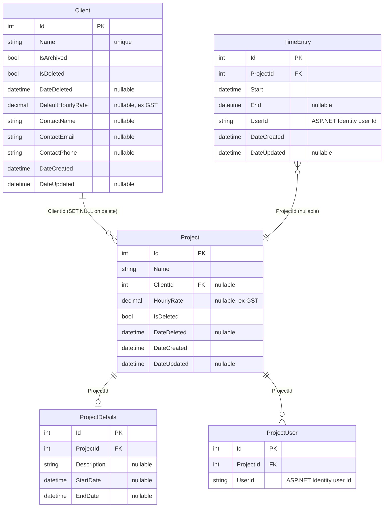
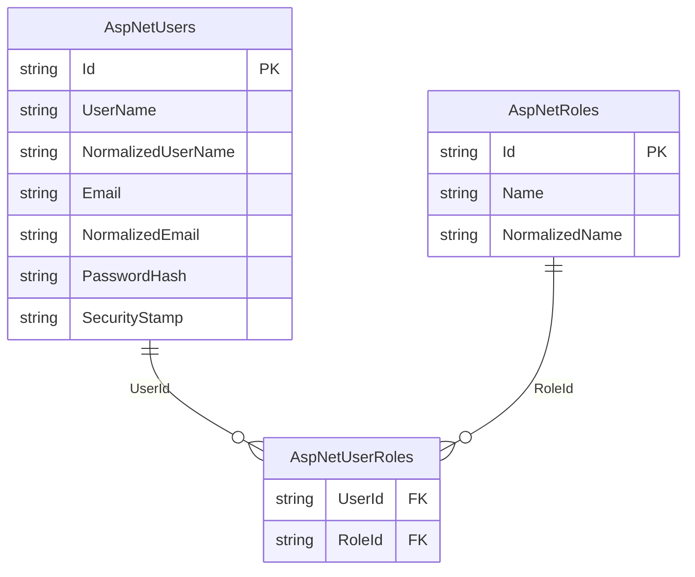

# TimeTracker — Architecture

## Overview

TimeTracker is a personal timesheeting application for tracking time entries against projects, managing clients, and year-view reporting.

---

## Change log

| Date | Change | PR |
|------|--------|----|
| 2026-06 | Deployed to Azure App Service F1 + Azure SQL; GitHub Actions OIDC push-to-deploy | #43–45 |
| 2026-06 | Security hardening: CSP, HSTS, rate limiting, 83 tests | #42 |
| 2026-05 | MudBlazor UI uplift; replaced Tailwind + Radzen + QuickGrid | #38 |
| 2026-05 | Added `Clients` table; client CRUD feature; project–client FK; 12 new tests (51 total) | #29 |
| 2026-05 | Google OAuth; removed username/password login | #28 |
| 2026-05 | Renamed `TimeTracker.API` → `TimeTracker.Web` to align with documentation | #26 |
| 2026-05 | Added `TimeTracker.Tests` — 31 service integration tests (EF InMemory); CI runs `dotnet test` on every PR | #25 |
| 2026-05 | Migrated to Blazor SSR + Vertical Slice Architecture; removed `TimeTracker.Client` | #25 |
| 2026-05 | Upgraded solution from .NET 7 → .NET 10 | #20 |
| 2026-05 | Replaced Swashbuckle with native ASP.NET Core OpenAPI + Scalar UI (dev only) | #20 |

---

## Current State

### Solution structure

```
TimeTracker.sln
├── TimeTracker.Web         — ASP.NET Core + Blazor SSR + Vertical Slice features + REST API
├── TimeTracker.Shared      — EF Core entities only (class library)
└── TimeTracker.Tests       — xUnit service integration tests (EF InMemory)
```

```
TimeTracker.Web/
  Features/
    Auth/          — Login/Logout pages, ExternalLoginService
    Clients/       — IClientService, ClientService, ClientModels, ClientEndpoints, Pages/
    Projects/      — IProjectService, ProjectService, ProjectModels, ProjectEndpoints, Pages/
    TimeEntries/   — ITimeEntryService, TimeEntryService, TimeEntryModels, TimeEntryEndpoints, Pages/
  Shared/
    IUserContextService, UserContextService
    Components/    — reusable Blazor components
    Layout/        — MainLayout, NavMenu, LoginDisplay
  Data/            — TimeTrackerDataContext, IdentityDataContext
```

### Runtime

- **.NET 10**
- Single process: Blazor Interactive Server serves pages via SignalR; REST API endpoints on the same host
- Deployed to **Azure App Service F1** with **Azure SQL Database** (free offer)
- Runs at `https://localhost:7006` (dev). API docs at `/scalar/v1` (dev only).

### Data layer

Two EF Core `DbContext`s, both targeting **SQL Server** (`TimeTrackerDb`):

| Context | Schema | Tables |
|---------|--------|--------|
| `TimeTrackerDataContext` | `app` | `Clients`, `TimeEntries`, `Projects`, `ProjectDetails`, `ProjectUsers` |
| `IdentityDataContext` | `id` | ASP.NET Identity tables |

- `Client` is shared across all users — no `UserId` scoping. `Name` has a unique index. `DefaultHourlyRate` is nullable (ex GST). Supports soft-delete (`IsDeleted`) for recoverability and archiving (`IsArchived`) to hide inactive clients from dropdowns without deleting them.
- `Project` uses soft-delete (`SoftDeleteableEntity`). `ClientId` is a nullable FK — deleting a client with active projects is blocked at the service layer; the DB cascades to `SET NULL` if bypassed.
- `TimeEntry` stores `UserId` (string) rather than a navigation property to avoid cascade delete issues
- **Mapster** handles entity ↔ DTO mapping, configured via per-feature `IRegister` classes scanned at startup

### Architecture

**Vertical Slice Architecture** — no controllers, no repository layer.

- Feature services (`ITimeEntryService`, `IProjectService`, `IAuthService`) injected directly into Blazor pages and minimal API endpoints
- `IUserContextService` extracts the current user's ID from `HttpContext` claims and scopes all queries per user
- REST API endpoints registered via `MapTimeEntryEndpoints()` / `MapProjectEndpoints()` — retained for future Zoho Books integration
- DTOs live in feature-scoped `*Models.cs` files; entities are never exposed to the UI layer

### Authentication

**Cookie-based** with ASP.NET Identity + Google OAuth:
- HTTP-only, Secure, SameSite=Strict cookies; 1-day expiration
- Google OAuth via `Microsoft.AspNetCore.Authentication.Google`; provider-agnostic callback via `SignInManager`
- Allowed emails gated via `Authentication:AllowedEmails` config list
- Login at `/login`, logout at `/logout`
- Local dev DB credentials via **.NET User Secrets** (`DbUser`, `DbPassword`)

### Frontend

**Blazor Interactive Server** (`InteractiveServerRenderMode`) with **MudBlazor** component library. All pages run over a persistent SignalR WebSocket connection. SignalR is removed in Phase 10.

### Infrastructure

| Concern | Solution | Cost |
|---------|----------|------|
| Hosting | Azure App Service F1 | Free — hard limit, no overage possible |
| Database | Azure SQL Database free offer | Free — 32 GB, 7-day automated backups, no expiry |
| Auth | Google OAuth 2.0 via ASP.NET Identity | Free |
| CI/CD | GitHub Actions — OIDC push-to-deploy | Free |
| Tests | 83 service integration tests (EF InMemory) | — |

---

## Data Model

### `app` schema



### `id` schema (ASP.NET Identity)



> `TimeEntry.UserId` and `ProjectUser.UserId` reference `AspNetUsers.Id` by convention (string foreign key). No FK constraint is defined to avoid cascade delete issues.

---

## Planned phases

#### Phase 9 — Playwright UX regression testing

Establish a UI regression baseline before the WASM migration.

- Add `TimeTracker.Playwright` project
- Implement auth setup (storage state or dev bypass — TBD)
- Cover all golden paths: login, timer, entries, projects, clients, reports
- Playwright job in GitHub Actions runs after `deploy-live`

#### Phase 10 — WASM islands (remove SignalR)

Replace Blazor Interactive Server with static SSR + targeted WASM islands.

- Remove global `InteractiveServerRenderMode` from `Routes.razor` — pages default to static SSR
- Add `Microsoft.AspNetCore.Components.WebAssembly.Server`; create HTTP service implementations for WASM context
- **WASM islands:** `TimerPage`, `EntrySheet`, `ProjectSheet`, `ClientSheet`
- **Static SSR:** all other pages
- `TimeEntriesPage` tab/date navigation replaced with URL query params

#### Phase 11 — GitHub Pages showcase ⚠️ Needs detailed planning

Add `TimeTracker.Showcase` standalone WASM project. Shares Razor components with the live app; runs entirely in the browser with mock data. Deployed to GitHub Pages via a second job in the existing GitHub Actions workflow.

---

## Target solution structure (Phase 11)

```
TimeTracker.sln
├── TimeTracker.Web      — ASP.NET Core host: static SSR pages + WASM islands + Minimal API
├── TimeTracker.Showcase — Standalone Blazor WASM project (GitHub Pages portfolio)
├── TimeTracker.Shared   — EF Core entities + DTOs + service interfaces
└── TimeTracker.Tests    — xUnit service integration tests (EF InMemory)
```

---

## Development setup

### Prerequisites
- .NET 10 SDK
- Docker Desktop (Windows) — for local SQL Server

### SQL Server (Docker)
```bash
docker run \
  -e "ACCEPT_EULA=Y" \
  -e "MSSQL_SA_PASSWORD=YourStrong@Passw0rd" \
  -p 1435:1433 \
  --name timetracker-sql \
  -d mcr.microsoft.com/mssql/server:2022-latest
```

> Port 1435 is used because 1433 and 1434 are reserved by the Windows SQL Server instance.
> Connect via SSMS using `127.0.0.1,1435`, SQL auth (sa), with `Encrypt=false;TrustServerCertificate=true` in Additional Connection Parameters.

### User secrets
```bash
cd TimeTracker.Web
dotnet user-secrets set "DbUser" "sa"
dotnet user-secrets set "DbPassword" "YourStrong@Passw0rd"
```

### Run
```bash
cd TimeTracker.Web
dotnet run
# App: https://localhost:7006
# API docs (dev): https://localhost:7006/scalar/v1
```

### EF Core migrations
```bash
cd TimeTracker.Web
dotnet ef migrations add <Name> --context TimeTrackerDataContext
dotnet ef migrations add <Name> --context IdentityDataContext
dotnet ef database update --context TimeTrackerDataContext
dotnet ef database update --context IdentityDataContext
```
