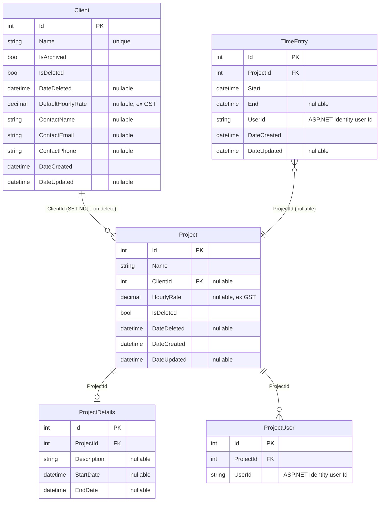
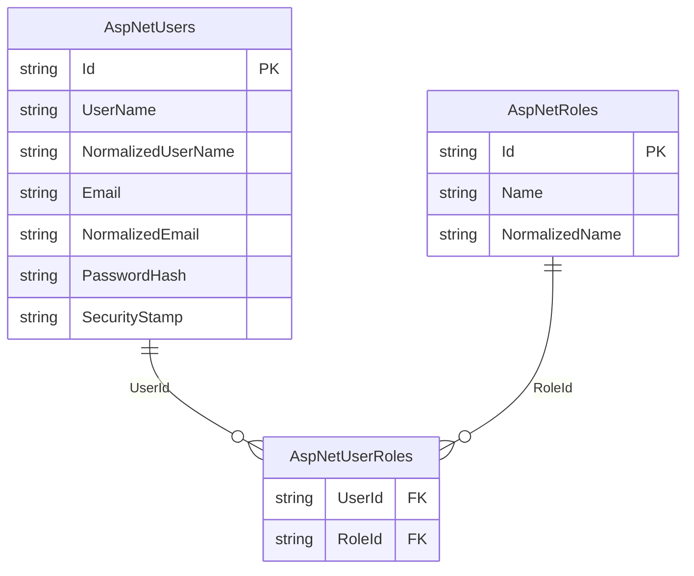

# TimeTracker — Architecture

## Overview

TimeTracker is a personal timesheeting application for tracking time entries against projects, managing clients, and year-view reporting.

---

## Change log

| Date | Change | PR/Branch |
|------|--------|-----------|
| 2026-06 | **Global InteractiveWebAssembly** — abandoned SSR+WASM islands hybrid; MudBlazor #9743 prevents interactive layouts in SSR | `feature/wasm-islands` |
| 2026-06 | Renamed `TimeTracker.Wasm` → `TimeTracker.Client` (Microsoft standard .Client naming) | `feature/wasm-islands` |
| 2026-06 | Added `TimeTracker.Contracts` — shared DTOs; `CookieAuthenticationStateProvider`; `/api/auth/user` endpoint; `ReportsCalculations` static class; 92 unit tests | `feature/wasm-islands` |
| 2026-06 | Added `TimeTracker.Playwright` — E2E tests; Cloudflare custom domain `timetracker.dzk.com.au` | #43–56 |
| 2026-06 | Deployed to Azure App Service F1 + Azure SQL; GitHub Actions OIDC push-to-deploy | #43–45 |
| 2026-06 | Security hardening: CSP, HSTS, rate limiting, 83 tests | #42 |
| 2026-05 | MudBlazor UI uplift; replaced Tailwind + Radzen + QuickGrid | #38 |
| 2026-05 | Added `Clients` table; client CRUD feature; project–client FK; 12 new tests (51 total) | #29 |
| 2026-05 | Google OAuth; removed username/password login | #28 |
| 2026-05 | Renamed `TimeTracker.API` → `TimeTracker.Web` to align with documentation | #26 |
| 2026-05 | Added `TimeTracker.Tests` — 31 service integration tests (EF InMemory); CI runs `dotnet test` on every PR | #25 |
| 2026-05 | Migrated to Blazor SSR + Vertical Slice Architecture; removed `TimeTracker.Client` | #25 |
| 2026-05 | Upgraded solution from .NET 7 → .NET 10 | #20 |
| 2026-05 | Replaced Swashbuckle with native ASP.NET Core OpenAPI + Scalar UI (dev only) | #20 |

---

## Current State

### Solution structure

```
TimeTracker.sln
├── TimeTracker.Web         — ASP.NET Core host: App.razor shell, API endpoints, EF Core, static assets
├── TimeTracker.Client      — Blazor WASM client: all routed pages, layouts, HTTP services
├── TimeTracker.Contracts   — Shared DTOs and interfaces (referenced by both Web and Client)
├── TimeTracker.Shared      — EF Core entities only (referenced by Web only)
├── TimeTracker.Tests       — xUnit unit tests (EF InMemory, no running DB required)
└── TimeTracker.Playwright  — End-to-end Playwright browser tests
```

```
TimeTracker.Web/
  Features/
    Auth/          — Login/Logout pages, ExternalLoginService, /api/auth/user endpoint
    Clients/       — IClientService, ClientService, ClientModels, ClientEndpoints
    Projects/      — IProjectService, ProjectService, ProjectModels, ProjectEndpoints
    TimeEntries/   — ITimeEntryService, TimeEntryService, TimeEntryModels, TimeEntryEndpoints
    Reports/       — ReportsEndpoints (no SSR page — page lives in Client)
  Data/            — TimeTrackerDataContext, IdentityDataContext

TimeTracker.Client/
  Routes.razor     — WASM router; must live here for WASM to boot it
  Features/
    Auth/          — CookieAuthenticationStateProvider
    Clients/       — Pages/, Components/, HttpClientService
    Projects/      — Pages/, Components/, HttpProjectService
    TimeEntries/   — Pages/, Components/, HttpTimeEntryService
    Timer/         — Pages/
    Reports/       — Pages/
  Shared/
    Layout/        — MainLayout, NavMenu, BottomNav, LoginLayout
    Components/    — RedirectToLogin, shared UI
    Theme/         — DzkTheme
```

### Runtime

- **.NET 10**
- **Global InteractiveWebAssembly** rendering — `App.razor` renders `<Routes @rendermode="InteractiveWebAssembly" />`. The entire routed app runs as WASM in the browser. No SignalR.
- REST API endpoints served from the same ASP.NET Core host
- Deployed to **Azure App Service F1** with **Azure SQL Database** (free offer)
- Custom domain `timetracker.dzk.com.au` via Cloudflare proxy (Cloudflare terminates TLS)
- Runs at `https://localhost:7006` (dev). API docs at `/scalar/v1` (dev only).

### Data layer

Two EF Core `DbContext`s, both targeting **SQL Server** (`TimeTrackerDb`):

| Context | Schema | Tables |
|---------|--------|--------|
| `TimeTrackerDataContext` | `app` | `Clients`, `TimeEntries`, `Projects`, `ProjectDetails`, `ProjectUsers` |
| `IdentityDataContext` | `id` | ASP.NET Identity tables |

- `Client` is shared across all users — no `UserId` scoping. `Name` has a unique index. `DefaultHourlyRate` is nullable (ex GST). Supports soft-delete (`IsDeleted`) for recoverability and archiving (`IsArchived`) to hide inactive clients from dropdowns without deleting them.
- `Project` uses soft-delete (`SoftDeleteableEntity`). `ClientId` is a nullable FK — deleting a client with active projects is blocked at the service layer; the DB cascades to `SET NULL` if bypassed.
- `TimeEntry` stores `UserId` (string) rather than a navigation property to avoid cascade delete issues
- **Mapster** handles entity ↔ DTO mapping, configured via per-feature `IRegister` classes scanned at startup

### Architecture

**Vertical Slice Architecture** — no controllers, no repository layer.

- Feature services (`ITimeEntryService`, `IProjectService`, `IAuthService`) injected directly into minimal API endpoints on the server
- In `TimeTracker.Client`, HTTP service implementations (`HttpTimeEntryService`, etc.) call the REST API; these are what the WASM pages inject
- `IUserContextService` extracts the current user's ID from `HttpContext` claims and scopes all queries per user (server-side only)
- REST API endpoints registered via `MapTimeEntryEndpoints()` / `MapProjectEndpoints()` — retained for future Zoho Books integration
- DTOs live in `TimeTracker.Contracts/` — shared between Web (Mapster mapping source) and Client (HTTP deserialisation target)

### Authentication

**Cookie-based** with ASP.NET Identity + Google OAuth:
- HTTP-only, Secure, SameSite=Strict cookies; 1-day expiration
- `CookieCredentialHandler` in Client sends `BrowserRequestCredentials.Include` with every HTTP request so the auth cookie is forwarded
- `CookieAuthenticationStateProvider` calls `/api/auth/user` on first load to hydrate WASM auth state; result cached per circuit
- On 401 mid-session, pages call `Nav.NavigateTo("/login", forceLoad: true)` to force full reload and reset WASM state
- Google OAuth via `Microsoft.AspNetCore.Authentication.Google`; provider-agnostic callback via `SignInManager`
- OAuth challenge links use `data-enhance-nav="false"` to force full-page navigation (Blazor enhanced nav would turn it into a fetch, blocked by CSP)
- Allowed emails gated via `Authentication:AllowedEmails` config list
- Login at `/login`, logout at `/auth/logout`
- Local dev DB credentials via **.NET User Secrets** (`DbUser`, `DbPassword`)

### Rendering

**Global InteractiveWebAssembly** with **MudBlazor** component library.

- `App.razor` (server) is a non-interactive HTML shell only; it renders `<Routes @rendermode="InteractiveWebAssembly" />`
- `Routes.razor` and all layout/page components live in `TimeTracker.Client` — the WASM bundle does not include `TimeTracker.Web.dll`
- MudBlazor providers (`MudThemeProvider`, `MudPopoverProvider`, `MudDialogProvider`, `MudSnackbarProvider`) live once in `MainLayout.razor` — never on individual pages
- Never add `@rendermode` to individual pages — render mode is inherited globally
- `IWebAssemblyHostEnvironment` (not `IWebHostEnvironment`) is used in Client for environment checks

### Infrastructure

| Concern | Solution | Cost |
|---------|----------|------|
| Hosting | Azure App Service F1 | Free — hard limit, no overage possible |
| Database | Azure SQL Database free offer | Free — 32 GB, 7-day automated backups, no expiry |
| Auth | Google OAuth 2.0 via ASP.NET Identity | Free |
| CI/CD | GitHub Actions — OIDC push-to-deploy | Free |
| Tests | 83 service integration tests (EF InMemory) | — |

---

## Data Model

### `app` schema



### `id` schema (ASP.NET Identity)



> `TimeEntry.UserId` and `ProjectUser.UserId` reference `AspNetUsers.Id` by convention (string foreign key). No FK constraint is defined to avoid cascade delete issues.

---

## Planned phases

#### Current — Global WASM migration (`feature/wasm-islands`)

In progress. Migrating all remaining SSR pages to `TimeTracker.Client` so the WASM router can reach them. Full verification (build → unit tests → Playwright) required before merge.

#### Next — GitHub Pages showcase ⚠️ Needs planning session

Add a standalone WASM showcase project. Shares Razor components with the live app; runs in the browser with mock data. Deployed to GitHub Pages.

---

## Development setup

### Prerequisites
- .NET 10 SDK
- Docker Desktop (Windows) — for local SQL Server

### SQL Server (Docker)
```bash
docker run \
  -e "ACCEPT_EULA=Y" \
  -e "MSSQL_SA_PASSWORD=YourStrong@Passw0rd" \
  -p 1435:1433 \
  --name timetracker-sql \
  -d mcr.microsoft.com/mssql/server:2022-latest
```

> Port 1435 is used because 1433 and 1434 are reserved by the Windows SQL Server instance.
> Connect via SSMS using `127.0.0.1,1435`, SQL auth (sa), with `Encrypt=false;TrustServerCertificate=true` in Additional Connection Parameters.

### User secrets
```bash
cd TimeTracker.Web
dotnet user-secrets set "DbUser" "sa"
dotnet user-secrets set "DbPassword" "YourStrong@Passw0rd"
```

### Run
```bash
cd TimeTracker.Web
dotnet run
# App: https://localhost:7006
# API docs (dev): https://localhost:7006/scalar/v1
```

### EF Core migrations
```bash
cd TimeTracker.Web
dotnet ef migrations add <Name> --context TimeTrackerDataContext
dotnet ef migrations add <Name> --context IdentityDataContext
dotnet ef database update --context TimeTrackerDataContext
dotnet ef database update --context IdentityDataContext
```
