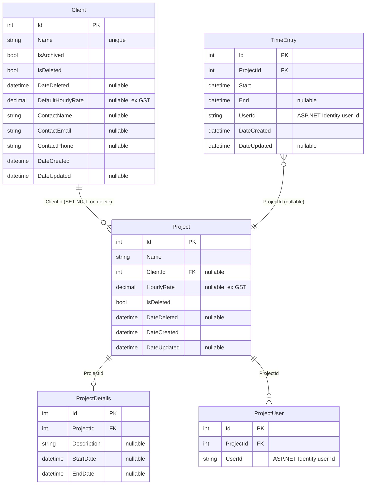
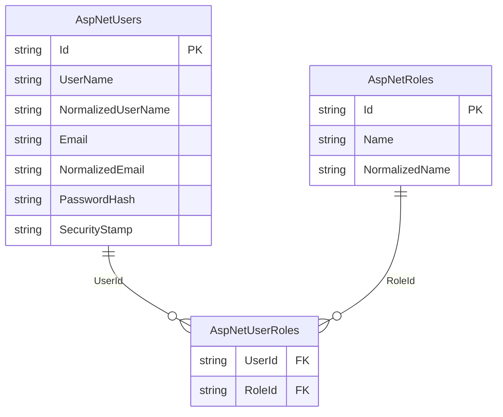

# TimeTracker — Architecture

## Overview

TimeTracker is a personal timesheeting application for tracking time entries against projects, managing clients, and year-view reporting.

---

## Change log

| Date | Change | PR/Branch |
|------|--------|-----------|
| 2026-06 | **Nightly database backup** — GitHub Actions `.bacpac` export via dedicated OIDC SP (custom role: firewall rule write/delete only); pushed to private `TimeTracker-backups` repo with 30-day rolling retention | #104 |
| 2026-06 | **SQL Server Row-Level Security + audit trail** — `UserSessionContextInterceptor` sets `SESSION_CONTEXT(N'UserId')` before every EF Core command; predicate functions filter per-user; `CreatedBy`/`UpdatedBy`/`DeletedBy` audit columns | #130 |
| 2026-06 | **Global InteractiveWebAssembly** — abandoned SSR+WASM islands hybrid; MudBlazor #9743 prevents interactive layouts in SSR | `feature/wasm-islands` |
| 2026-06 | Renamed `TimeTracker.Wasm` → `TimeTracker.Client` (Microsoft standard .Client naming) | `feature/wasm-islands` |
| 2026-06 | Added `TimeTracker.Contracts` — shared DTOs; `CookieAuthenticationStateProvider`; `/api/auth/user` endpoint; `ReportsCalculations` static class; 92 unit tests | `feature/wasm-islands` |
| 2026-06 | **GitHub Pages showcase** — `#if SHOWCASE` mock services; `wwwroot-showcase/` asset isolation; base-href-agnostic relative paths; SPA 404 routing; auto-deployed from `deploy.yml` | #72–78 |
| 2026-06 | Added `TimeTracker.Playwright` — E2E tests | #43–56 |
| 2026-06 | Deployed to Azure App Service F1 + Azure SQL; GitHub Actions OIDC push-to-deploy | #43–45 |
| 2026-06 | Security hardening: CSP, HSTS, rate limiting, 83 tests | #42 |
| 2026-05 | MudBlazor UI uplift; replaced Tailwind + Radzen + QuickGrid | #38 |
| 2026-05 | Added `Clients` table; client CRUD feature; project–client FK; 12 new tests (51 total) | #29 |
| 2026-05 | Google OAuth; removed username/password login | #28 |
| 2026-05 | Renamed `TimeTracker.API` → `TimeTracker.Web` to align with documentation | #26 |
| 2026-05 | Added `TimeTracker.Tests` — 31 service integration tests (EF InMemory); CI runs `dotnet test` on every PR | #25 |
| 2026-05 | Migrated to Blazor SSR + Vertical Slice Architecture; removed `TimeTracker.Client` | #25 |
| 2026-05 | Upgraded solution from .NET 7 → .NET 10 | #20 |
| 2026-05 | Replaced Swashbuckle with native ASP.NET Core OpenAPI + Scalar UI (dev only) | #20 |

---

## Current State

### Solution structure

```
TimeTracker.sln
├── TimeTracker.Web         — ASP.NET Core host: App.razor shell, API endpoints, EF Core, static assets
├── TimeTracker.Client      — Blazor WASM client: all routed pages, layouts, HTTP services
├── TimeTracker.Contracts   — Shared DTOs and interfaces (referenced by both Web and Client)
├── TimeTracker.Shared      — EF Core entities only (referenced by Web only)
├── TimeTracker.Tests       — xUnit unit tests (EF InMemory, no running DB required)
└── TimeTracker.Playwright  — End-to-end Playwright browser tests
```

```
TimeTracker.Web/
  Features/
    Auth/          — Login/Logout pages, ExternalLoginService, /api/auth/user endpoint
    Clients/       — IClientService, ClientService, ClientModels, ClientEndpoints
    Projects/      — IProjectService, ProjectService, ProjectModels, ProjectEndpoints
    TimeEntries/   — ITimeEntryService, TimeEntryService, TimeEntryModels, TimeEntryEndpoints
    Reports/       — ReportsEndpoints (no SSR page — page lives in Client)
  Data/            — TimeTrackerDataContext, IdentityDataContext

TimeTracker.Client/
  Routes.razor     — WASM router; must live here for WASM to boot it
  Features/
    Auth/          — CookieAuthenticationStateProvider
    Clients/       — Pages/, Components/, HttpClientService
    Projects/      — Pages/, Components/, HttpProjectService
    TimeEntries/   — Pages/, Components/, HttpTimeEntryService
    Timer/         — Pages/
    Reports/       — Pages/
  Shared/
    Layout/        — MainLayout, NavMenu, BottomNav, LoginLayout
    Components/    — RedirectToLogin, shared UI
    Theme/         — DzkTheme
```

### Runtime

- **.NET 10**
- **Global InteractiveWebAssembly** rendering — `App.razor` renders `<Routes @rendermode="InteractiveWebAssembly" />`. The entire routed app runs as WASM in the browser. No SignalR.
- REST API endpoints served from the same ASP.NET Core host
- Deployed to **Azure App Service F1** with **Azure SQL Database** (free offer)
- Deployed at `https://timetracker-zak.azurewebsites.net` (Azure F1 free tier does not support custom domains)
- Runs at `https://localhost:7006` (dev). API docs at `/scalar/v1` (dev only).

### Data layer

Two EF Core `DbContext`s, both targeting **SQL Server** (`TimeTrackerDb`):

| Context | Schema | Tables |
|---------|--------|--------|
| `TimeTrackerDataContext` | `app` | `Clients`, `TimeEntries`, `Projects`, `ProjectDetails`, `ProjectUsers` |
| `IdentityDataContext` | `id` | ASP.NET Identity tables |

- `Client` is shared across all users — no `UserId` scoping. `Name` has a unique index. `DefaultHourlyRate` is nullable (ex GST). Supports soft-delete (`IsDeleted`) for recoverability and archiving (`IsArchived`) to hide inactive clients from dropdowns without deleting them.
- `Project` uses soft-delete (`SoftDeleteableEntity`). `ClientId` is a nullable FK — deleting a client with active projects is blocked at the service layer; the DB cascades to `SET NULL` if bypassed.
- `TimeEntry` stores `UserId` (string) rather than a navigation property to avoid cascade delete issues
- **Mapster** handles entity ↔ DTO mapping, configured via per-feature `IRegister` classes scanned at startup

### Architecture

**Vertical Slice Architecture** — no controllers, no repository layer.

- Feature services (`ITimeEntryService`, `IProjectService`, `IAuthService`) injected directly into minimal API endpoints on the server
- In `TimeTracker.Client`, HTTP service implementations (`HttpTimeEntryService`, etc.) call the REST API; these are what the WASM pages inject
- `IUserContextService` extracts the current user's ID from `HttpContext` claims and scopes all queries per user (server-side only)
- REST API endpoints registered via `MapTimeEntryEndpoints()` / `MapProjectEndpoints()` — retained for future Zoho Books integration
- DTOs live in `TimeTracker.Contracts/` — shared between Web (Mapster mapping source) and Client (HTTP deserialisation target)

### Authentication

**Cookie-based** with ASP.NET Identity + Google OAuth:
- HTTP-only, Secure, SameSite=Strict cookies; 1-day expiration
- `CookieCredentialHandler` in Client sends `BrowserRequestCredentials.Include` with every HTTP request so the auth cookie is forwarded
- `CookieAuthenticationStateProvider` calls `/api/auth/user` on first load to hydrate WASM auth state; result cached per circuit
- On 401 mid-session, pages call `Nav.NavigateTo("login", forceLoad: true)` to force full reload and reset WASM state
- Google OAuth via `Microsoft.AspNetCore.Authentication.Google`; provider-agnostic callback via `SignInManager`
- OAuth challenge links use `data-enhance-nav="false"` to force full-page navigation (Blazor enhanced nav would turn it into a fetch, blocked by CSP)
- Access gated by pre-created Identity user records; `Authentication:AdminEmail` seeds the first admin at startup if no users exist
- Login at `/login`, logout at `/auth/logout`
- Local dev DB credentials via **.NET User Secrets** (`DbUser`, `DbPassword`)

### Rendering

**Global InteractiveWebAssembly** with **MudBlazor** component library.

- `App.razor` (server) is a non-interactive HTML shell only; it renders `<Routes @rendermode="InteractiveWebAssembly" />`
- `Routes.razor` and all layout/page components live in `TimeTracker.Client` — the WASM bundle does not include `TimeTracker.Web.dll`
- MudBlazor providers (`MudThemeProvider`, `MudPopoverProvider`, `MudDialogProvider`, `MudSnackbarProvider`) live once in `MainLayout.razor` — never on individual pages
- Never add `@rendermode` to individual pages — render mode is inherited globally
- `IWebAssemblyHostEnvironment` (not `IWebHostEnvironment`) is used in Client for environment checks

#### SSR prerender → WASM hydration patterns

Global WASM apps serve an SSR-prerendered HTML page first, then WASM boots and hydrates. Two patterns are in use to handle the gap:

**1. Disabling controls during prerender (`RendererInfo.IsInteractive`)**

Controls in `MainLayout` (e.g. the hamburger button) appear in the SSR HTML before WASM has attached event handlers. Adding `Disabled="@(!RendererInfo.IsInteractive)"` disables them during prerender and enables them once WASM is interactive. `RendererInfo.IsInteractive` is a .NET 9+ `ComponentBase` property: `false` during SSR prerender, `true` after WASM hydration.

Playwright's `ClickAsync` actionability check (waits for Enabled) automatically waits for WASM hydration — no custom wait logic needed. This is the Microsoft-documented approach; no test scaffolding in production code.

Source: https://learn.microsoft.com/en-us/aspnet/core/blazor/components/render-modes?view=aspnetcore-10.0

**2. Resetting layout state on navigation (`NavigationManager.LocationChanged`)**

`MainLayout` is a persistent WASM component — it is NOT destroyed on client-side navigation. State fields like `drawerOpen` retain their values across route changes. `OnLocationChanged` is the correct place to reset transient UI state:

```csharp
private void OnLocationChanged(object? sender, LocationChangedEventArgs e)
{
    drawerOpen = false;
    InvokeAsync(StateHasChanged);
}
```

`LocationChanged` fires on every navigation: browser-intercepted link clicks and programmatic `NavigateTo` calls. Source: https://learn.microsoft.com/en-us/aspnet/core/blazor/fundamentals/navigation?view=aspnetcore-10.0

Both decisions were explicit and researched — see [D001](decisions.md#d001-global-wasm-rendering-over-ssr--wasm-islands) (why not SSR + islands) and [D002](decisions.md#d002-mudblazor-over-fluent-ui-blazor-and-bootstrap) (why MudBlazor). Full justification including MudBlazor GitHub issues, the six render-mode constraints, and Fluent UI migration cost is in the [Reference section](#reference) below.

#### Orphaned reference in dropdowns

When a record holds a foreign key to an item that is no longer available for selection (e.g. a time entry referencing a project the user is no longer assigned to), the dropdown must not show a blank or broken field. The pattern:

1. Load the list of currently selectable items (e.g. `GetAssignedProjects`)
2. If the record's current value is **not** in that list, append it as a **disabled item** with a label indicating its status (e.g. `"Project Name (not assigned)"`)
3. The binding resolves correctly to the current value; the disabled item is visible but not selectable

```razor
@* In EntrySheet — project dropdown *@
@foreach (var p in _assignedProjects)
{
    <MudSelectItem Value="@p.Id">@p.Name</MudSelectItem>
}
@if (_orphanedProject is not null)
{
    <MudSelectItem Value="@_orphanedProject.Id" Disabled="true">
        @_orphanedProject.Name (not assigned)
    </MudSelectItem>
}
```

This pattern applies whenever: (a) a picker is restricted to a subset of items, and (b) an existing record may reference an item outside that subset. See [D024](decisions.md#d024-projectuser-as-time-allocation-gate--orphaned-reference-pattern) for the decision context.

#### API query abuse protection — defence in depth (see [D018](decisions.md#d018-defence-in-depth-for-api-query-abuse--pagination-cap--global-rate-limiting--cancellation-tokens))

Three independent layers work together to prevent expensive or abusive API requests from exhausting the Azure SQL free-tier connection pool:

1. **Server-side pagination cap** — `Math.Min(limit, 200)` in `TimeEntryService.ToWrapper` caps the cost of any single paginated request. The two unbounded `/all` endpoints (used by reports) cannot be capped and are instead covered by a tighter rate limit policy.
2. **Global rate limiting** — a global default policy covers all endpoints automatically; named policies override the default where tighter limits are needed.
3. **Cancellation tokens** — `CancellationToken` threaded through all service methods and EF Core calls ensures abandoned requests release SQL connections immediately rather than running to completion.

#### Rate limiting — policies

All policies are driven from `RateLimiting` config in `appsettings.json` so limits can differ per environment without code changes. Code falls back to defaults if config keys are absent. Reference: https://learn.microsoft.com/en-us/aspnet/core/performance/rate-limit?view=aspnetcore-10.0

| Policy | Endpoints | Production limit | Dev override |
|--------|-----------|-----------------|--------------|
| Global default | All endpoints not otherwise decorated | 120 req/min | — |
| `"write"` | Mutating endpoints (POST/PUT/DELETE on data) | 60 req/min | — |
| `"all-entries"` | `/year/{year}/all`, `/project/{id}/all` | 10 req/min | — |
| `"auth"` | `/auth/challenge`, `/auth/callback` | 10 req/min | — (same) |
| `"auth-status"` | `/api/auth/user` | 10 req/min | 200 req/min |

**Why global default over per-endpoint decoration:** New endpoints are covered automatically; named policies override where tighter limits are needed. Per-endpoint decoration risks missing a new endpoint.

**Why the auth split:** OWASP rate limiting guidance targets credential submission endpoints to prevent brute force. `/api/auth/user` is a read-only cookie validation; applying the same 10/min limit caused the Playwright test suite to fail mid-run with 429s. Reference: https://cheatsheetseries.owasp.org/cheatsheets/Authentication_Cheat_Sheet.html

**Dev override location:** `appsettings.Development.json` → `RateLimiting:AuthStatus:PermitLimit = 200`. Production `appsettings.json` keeps both at 10.

### Logging

Serilog replaces the default ASP.NET Core logger. Production writes structured JSON to stdout, which Azure App Service captures in the log stream. Development uses plain text for readability. Both environments are configured via `appsettings.json` / `appsettings.Development.json` using `ReadFrom.Configuration`.

Request logging is handled by `app.UseSerilogRequestLogging()`, placed after `UseStaticFiles` to avoid logging static asset requests.

### Health checks

Two endpoints, separated by intent:

| Endpoint | Auth | DB ping | Purpose |
|----------|------|---------|---------|
| `GET /health` | Anonymous | ❌ | Liveness — process is running. Safe for UptimeRobot every 5 min. |
| `GET /health/detail` | Required | ✅ | Readiness — EF Core connectivity check on both DbContexts. Manual use only. |

`/health` deliberately omits the DB ping. The Azure SQL free tier allows 100,000 vCore seconds/month (~55 hours at minimum 0.5 vCores). An external monitor pinging the DB every 5 minutes would prevent auto-pause and exhaust the free allowance in ~2 days.

UptimeRobot monitors `/health` every 5 minutes — see [`docs/uptimerobot-setup.md`](uptimerobot-setup.md).

Application Insights is not included (pay-as-you-go, no free monthly allowance on current workspace-based model). Future APM path is OpenTelemetry → Grafana Cloud ([#121](https://github.com/zkarachiwala/TimeTracker/issues/121)). See [D019](decisions.md#d019-serilog--health-endpoint--uptimerobot-over-application-insights) and [TD23](technical-debt.md#observability).

### Infrastructure

| Concern | Solution | Cost |
|---------|----------|------|
| Live app hosting | Azure App Service F1 | Free — hard limit, no overage possible |
| Showcase hosting | GitHub Pages | Free |
| Database | Azure SQL Database free offer | Free — 32 GB, 7-day automated backups, no expiry |
| Database backup | GitHub Actions nightly `.bacpac` export → private `TimeTracker-backups` repo, 30-day retention | Free (within 2,000 min/month Actions quota) |
| Auth | Google OAuth 2.0 via ASP.NET Identity | Free |
| CI/CD | GitHub Actions — OIDC push-to-deploy | Free |
| Structured logging | Serilog → stdout (Azure App Service log stream) | Free |
| Uptime monitoring | UptimeRobot free tier → `/health` endpoint | Free |
| Tests | 110 service integration tests (EF InMemory) | — |

---

## Data Model

### `app` schema



### `id` schema (ASP.NET Identity)



> `TimeEntry.UserId` and `ProjectUser.UserId` reference `AspNetUsers.Id` by convention (string foreign key). No FK constraint is defined to avoid cascade delete issues.

---

## Decision register

See **[docs/decisions.md](decisions.md)** — 15 decisions (D001–D015) covering rendering architecture, component library, hosting, auth, data access, CI, and showcase deployment.

## Technical debt register

See **[docs/technical-debt.md](technical-debt.md)** — 22 entries (TD1–TD22) across infrastructure, CI/CD, auth, observability, security, and networking. Each entry links to the relevant decision where applicable.

---

## Phase 11 — GitHub Pages showcase ✅

Standalone Blazor WASM showcase deployed to [zkarachiwala.github.io/TimeTracker](https://zkarachiwala.github.io/TimeTracker/). Reuses all `TimeTracker.Client` components unchanged; swaps in-memory mock services at compile time via `#if SHOWCASE`.

### Key decisions

- **[D011](decisions.md#d011-showcase--zero-changes-to-trackerclient)** — zero changes to `TimeTracker.Client`; mock services injected via `#if SHOWCASE` in `Program.cs`
- **[D012](decisions.md#d012-showcase--in-memory-persistence)** — in-memory persistence only; resets on refresh; acceptable for a portfolio demo
- **[D013](decisions.md#d013-showcase--demo-watermark-in-apprazor)** — demo watermark in `App.razor`; no production regression risk
- **[D014](decisions.md#d014-showcase--github-pages-deployment)** — GitHub Pages deployment via `deploy.yml` showcase job; `gh-pages` branch; public repo
- **[D015](decisions.md#d015-showcase-static-assets-isolated-to-wwwroot-showcase)** — showcase assets isolated to `wwwroot-showcase/`; MSBuild conditional `ItemGroup` makes them invisible to the normal SDK build, preventing asset fingerprint churn in dev

### Routing under subpath hosting

GitHub Pages serves the showcase at `/TimeTracker/` (not `/`). `<base href="/TimeTracker/" />` is required, which means all navigation must use **relative paths** — absolute hrefs (`/entries`) resolve outside the app base URI. All `Href=` attributes, `Nav.NavigateTo()` calls, and image `src=` references in `TimeTracker.Client` are base-href-agnostic (no leading `/`). `BottomNav.ActiveClass` uses `Nav.ToBaseRelativePath` rather than `AbsolutePath` to correctly detect the active route under any base.

---

## Reference

Deep-dive justifications for decisions that have permanent architectural impact. These sections are referenced from [decisions.md](decisions.md) — the decision summaries live there; the evidence lives here.

### Why global WASM — not SSR + WASM islands

This was an explicit, researched decision. Do not revisit without re-reading this section. See also [D001](decisions.md#d001-global-wasm-rendering-over-ssr--wasm-islands).

The original Phase 10 plan targeted true WASM islands: SSR router, only interactive components compiled into `TimeTracker.Client`. This was abandoned for two independent sets of reasons: fundamental .NET render-model constraints that apply regardless of UI library, and MudBlazor-specific incompatibilities.

#### A — Architectural reasons (independent of MudBlazor)

These apply to any Blazor app using the hybrid/islands model and are documented in the [ASP.NET Core Blazor render modes (.NET 10)](https://learn.microsoft.com/en-us/aspnet/core/blazor/components/render-modes?view=aspnetcore-10.0) reference.

1. **`RenderFragment` parameters cannot cross the SSR → WASM render boundary.** The docs state explicitly: *"Parameters passed to an interactive child component from a Static parent must be JSON serializable. This means that you can't pass render fragments or child content from a Static parent component to an interactive child component."* The runtime error is `System.InvalidOperationException: Cannot pass the parameter 'ChildContent'… because the parameter is of the delegate type… which is arbitrary code and cannot be serialized.` Nearly every composable Blazor component (layouts, cards, content wrappers) uses `ChildContent` — a `RenderFragment`. In an islands model, each such component either cannot cross the SSR→WASM boundary or must be wrapped in a parameter-free adapter component.

2. **State is not shared across render mode boundaries.** In global WASM, after prerender, all component state lives in one WASM process. In a hybrid app, each WASM island is isolated: data fetched during SSR prerender must be serialised through `PersistentComponentState` and deserialised in every individual island. The docs note that without this, *"state used during prerendering is lost and must be recreated when the app is fully loaded,"* causing visible UI flicker per island.

3. **Client-side routing exits on SSR page navigation, forcing a full-page reload.** The docs describe `[ExcludeFromInteractiveRouting]` (which applies to SSR pages): *"Inbound navigation is forced to perform a full-page reload instead of resolving the page via interactive routing."* In a hybrid app, navigating between WASM islands and SSR pages exits Blazor's SPA router on every navigation. In global WASM, the WASM router handles all navigation in the browser — no server round-trip after initial load.

4. **WASM-only DI services fail at prerender time per island.** The docs note: *"Client-side services fail to resolve during prerendering."* In global WASM this is a single architectural problem solved once. In islands, every island must independently guard against WASM-only service injection.

5. **Azure F1 CPU budget.** Global WASM offloads all UI compute to the client. The [Blazor hosting models doc](https://learn.microsoft.com/en-us/aspnet/core/blazor/hosting-models?view=aspnetcore-10.0) explicitly states: *"When it's possible to offload most or all of an app's processing to clients… Blazor WebAssembly… is the best choice."* In a hybrid SSR app, the server renders each SSR page on every navigation. In global WASM, the server serves static files and API responses only.

6. **Offline capability.** Global WASM is the prerequisite for PWA/offline support. A hybrid SSR app can never be offline. Not currently implemented but the architecture preserves the option. Reference: [ASP.NET Core Blazor Progressive Web Application](https://learn.microsoft.com/en-us/aspnet/core/blazor/progressive-web-app?view=aspnetcore-10.0).

#### B — MudBlazor-specific incompatibilities

1. **`MudDrawer` is broken in SSR layouts** — [MudBlazor #9743](https://github.com/MudBlazor/MudBlazor/issues/9743). Closed as **not planned** by MudBlazor maintainers.

2. **`MudNavMenu` cannot be toggled on SSR pages** — [MudBlazor/Templates #478](https://github.com/MudBlazor/Templates/issues/478). Showstopper for a mobile-first app.

3. **MudBlazor providers require an interactive render context** — `MudThemeProvider`, `MudDialogProvider`, `MudSnackbarProvider`, `MudPopoverProvider` cannot function in static SSR. Confirmed in [MudBlazor Discussion #7430](https://github.com/MudBlazor/MudBlazor/discussions/7430).

4. **Theme flash** — `MudThemeProvider` applies colours at SSR render time then reapplies when WASM boots, causing a visible colour flash. No fix. [MudBlazor #10946](https://github.com/MudBlazor/MudBlazor/issues/10946).

**Conclusion:** Global `InteractiveWebAssembly` is the correct and stable choice. Group A applies regardless of UI library. Group B applies specifically to MudBlazor. All routed pages and layouts must live in `TimeTracker.Client`. `TimeTracker.Web` is a shell: API endpoints, EF Core, and the `App.razor` HTML wrapper only.

---

### Why MudBlazor — not Fluent UI Blazor or Bootstrap

See also [D002](decisions.md#d002-mudblazor-over-fluent-ui-blazor-and-bootstrap). MudBlazor was chosen over Microsoft-aligned alternatives when the UI was overhauled in PR #38.

| Library | Design system | SSR support | Architecture |
|---------|--------------|-------------|--------------|
| **MudBlazor** | Material Design (Google) | ❌ Not supported | Pure C# — no JS web component layer |
| **Fluent UI Blazor** | Fluent Design (Microsoft) | ✅ Supported | Wraps FAST/TypeScript web components |
| **Bootstrap scaffold** | Bootstrap | ✅ Supported | Minimal dotnet template components only |

**MudBlazor over Fluent UI Blazor:**

1. **Design system.** Material Design is the dominant language on Android and consumer web. Fluent is built for Microsoft 365 / Windows 11 productivity tooling — wrong register for a personal mobile-first app.

2. **Community size** (verified via GitHub API, 2026-06-08): MudBlazor 10,430 stars / 445+ contributors / monthly releases vs. Fluent UI Blazor 4,754 stars / ~30 contributors / quarterly releases. 2.2× star count, 14× contributor differential.

3. **Pure C#.** MudBlazor has no JS dependency. Fluent UI Blazor wraps Microsoft's FAST TypeScript web components — behaviour ultimately debuggable only in the browser's JS runtime.

4. **SSR non-support is resolved.** The global WASM architecture eliminates MudBlazor's SSR limitation. The trade-off is accepted and locked in.

**Bootstrap scaffold:** ships only minimal template components. Building a mobile-first app with drawers, date pickers, data grids, dialogs, and snackbars from Bootstrap primitives requires a second library anyway.

**Cost to switch to Fluent UI Blazor** (~10 routed pages, ~5 layout/shared components):

| Work item | Effort |
|-----------|--------|
| Component rename + parameter remap (simple pages) | 1–2 days |
| Complex pages (forms, data grids, dialogs) | 0.5–1 day |
| Theme rebuild (Material → Fluent design tokens) | 1–2 days |
| Layout restructure + provider registration | 0.5 day |
| Icon set change (Material → Fluent icons) | 0.5 day |
| Design review | 0.5–1 day |
| Full regression test | 1 day |
| **Total** | **~5–10 person-days** |

No functional change for users. The only gain is re-enabling the islands option (which has its own costs) and Microsoft design language alignment (a regression for this app's intent). Not justified.
