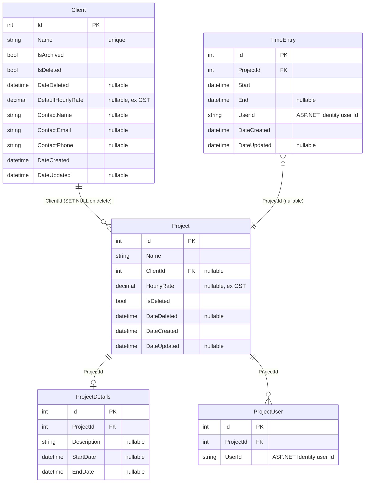
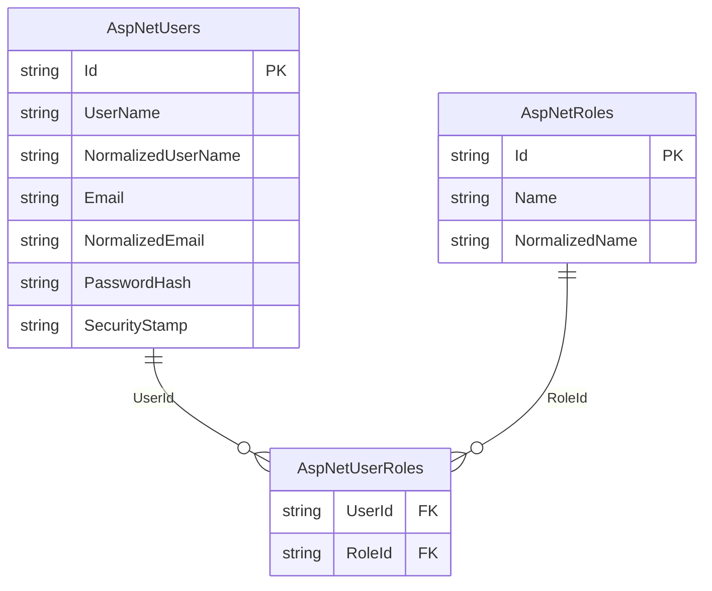

# TimeTracker — Architecture

## Overview

TimeTracker is a personal timesheeting application for tracking time entries against projects, managing clients, and year-view reporting.

---

## Change log

| Date | Change | PR/Branch |
|------|--------|-----------|
| 2026-06 | **Global InteractiveWebAssembly** — abandoned SSR+WASM islands hybrid; MudBlazor #9743 prevents interactive layouts in SSR | `feature/wasm-islands` |
| 2026-06 | Renamed `TimeTracker.Wasm` → `TimeTracker.Client` (Microsoft standard .Client naming) | `feature/wasm-islands` |
| 2026-06 | Added `TimeTracker.Contracts` — shared DTOs; `CookieAuthenticationStateProvider`; `/api/auth/user` endpoint; `ReportsCalculations` static class; 92 unit tests | `feature/wasm-islands` |
| 2026-06 | Added `TimeTracker.Playwright` — E2E tests; Cloudflare custom domain `timetracker.dzk.com.au` | #43–56 |
| 2026-06 | Deployed to Azure App Service F1 + Azure SQL; GitHub Actions OIDC push-to-deploy | #43–45 |
| 2026-06 | Security hardening: CSP, HSTS, rate limiting, 83 tests | #42 |
| 2026-05 | MudBlazor UI uplift; replaced Tailwind + Radzen + QuickGrid | #38 |
| 2026-05 | Added `Clients` table; client CRUD feature; project–client FK; 12 new tests (51 total) | #29 |
| 2026-05 | Google OAuth; removed username/password login | #28 |
| 2026-05 | Renamed `TimeTracker.API` → `TimeTracker.Web` to align with documentation | #26 |
| 2026-05 | Added `TimeTracker.Tests` — 31 service integration tests (EF InMemory); CI runs `dotnet test` on every PR | #25 |
| 2026-05 | Migrated to Blazor SSR + Vertical Slice Architecture; removed `TimeTracker.Client` | #25 |
| 2026-05 | Upgraded solution from .NET 7 → .NET 10 | #20 |
| 2026-05 | Replaced Swashbuckle with native ASP.NET Core OpenAPI + Scalar UI (dev only) | #20 |

---

## Current State

### Solution structure

```
TimeTracker.sln
├── TimeTracker.Web         — ASP.NET Core host: App.razor shell, API endpoints, EF Core, static assets
├── TimeTracker.Client      — Blazor WASM client: all routed pages, layouts, HTTP services
├── TimeTracker.Contracts   — Shared DTOs and interfaces (referenced by both Web and Client)
├── TimeTracker.Shared      — EF Core entities only (referenced by Web only)
├── TimeTracker.Tests       — xUnit unit tests (EF InMemory, no running DB required)
└── TimeTracker.Playwright  — End-to-end Playwright browser tests
```

```
TimeTracker.Web/
  Features/
    Auth/          — Login/Logout pages, ExternalLoginService, /api/auth/user endpoint
    Clients/       — IClientService, ClientService, ClientModels, ClientEndpoints
    Projects/      — IProjectService, ProjectService, ProjectModels, ProjectEndpoints
    TimeEntries/   — ITimeEntryService, TimeEntryService, TimeEntryModels, TimeEntryEndpoints
    Reports/       — ReportsEndpoints (no SSR page — page lives in Client)
  Data/            — TimeTrackerDataContext, IdentityDataContext

TimeTracker.Client/
  Routes.razor     — WASM router; must live here for WASM to boot it
  Features/
    Auth/          — CookieAuthenticationStateProvider
    Clients/       — Pages/, Components/, HttpClientService
    Projects/      — Pages/, Components/, HttpProjectService
    TimeEntries/   — Pages/, Components/, HttpTimeEntryService
    Timer/         — Pages/
    Reports/       — Pages/
  Shared/
    Layout/        — MainLayout, NavMenu, BottomNav, LoginLayout
    Components/    — RedirectToLogin, shared UI
    Theme/         — DzkTheme
```

### Runtime

- **.NET 10**
- **Global InteractiveWebAssembly** rendering — `App.razor` renders `<Routes @rendermode="InteractiveWebAssembly" />`. The entire routed app runs as WASM in the browser. No SignalR.
- REST API endpoints served from the same ASP.NET Core host
- Deployed to **Azure App Service F1** with **Azure SQL Database** (free offer)
- Custom domain `timetracker.dzk.com.au` via Cloudflare proxy (Cloudflare terminates TLS)
- Runs at `https://localhost:7006` (dev). API docs at `/scalar/v1` (dev only).

### Data layer

Two EF Core `DbContext`s, both targeting **SQL Server** (`TimeTrackerDb`):

| Context | Schema | Tables |
|---------|--------|--------|
| `TimeTrackerDataContext` | `app` | `Clients`, `TimeEntries`, `Projects`, `ProjectDetails`, `ProjectUsers` |
| `IdentityDataContext` | `id` | ASP.NET Identity tables |

- `Client` is shared across all users — no `UserId` scoping. `Name` has a unique index. `DefaultHourlyRate` is nullable (ex GST). Supports soft-delete (`IsDeleted`) for recoverability and archiving (`IsArchived`) to hide inactive clients from dropdowns without deleting them.
- `Project` uses soft-delete (`SoftDeleteableEntity`). `ClientId` is a nullable FK — deleting a client with active projects is blocked at the service layer; the DB cascades to `SET NULL` if bypassed.
- `TimeEntry` stores `UserId` (string) rather than a navigation property to avoid cascade delete issues
- **Mapster** handles entity ↔ DTO mapping, configured via per-feature `IRegister` classes scanned at startup

### Architecture

**Vertical Slice Architecture** — no controllers, no repository layer.

- Feature services (`ITimeEntryService`, `IProjectService`, `IAuthService`) injected directly into minimal API endpoints on the server
- In `TimeTracker.Client`, HTTP service implementations (`HttpTimeEntryService`, etc.) call the REST API; these are what the WASM pages inject
- `IUserContextService` extracts the current user's ID from `HttpContext` claims and scopes all queries per user (server-side only)
- REST API endpoints registered via `MapTimeEntryEndpoints()` / `MapProjectEndpoints()` — retained for future Zoho Books integration
- DTOs live in `TimeTracker.Contracts/` — shared between Web (Mapster mapping source) and Client (HTTP deserialisation target)

### Authentication

**Cookie-based** with ASP.NET Identity + Google OAuth:
- HTTP-only, Secure, SameSite=Strict cookies; 1-day expiration
- `CookieCredentialHandler` in Client sends `BrowserRequestCredentials.Include` with every HTTP request so the auth cookie is forwarded
- `CookieAuthenticationStateProvider` calls `/api/auth/user` on first load to hydrate WASM auth state; result cached per circuit
- On 401 mid-session, pages call `Nav.NavigateTo("/login", forceLoad: true)` to force full reload and reset WASM state
- Google OAuth via `Microsoft.AspNetCore.Authentication.Google`; provider-agnostic callback via `SignInManager`
- OAuth challenge links use `data-enhance-nav="false"` to force full-page navigation (Blazor enhanced nav would turn it into a fetch, blocked by CSP)
- Allowed emails gated via `Authentication:AllowedEmails` config list
- Login at `/login`, logout at `/auth/logout`
- Local dev DB credentials via **.NET User Secrets** (`DbUser`, `DbPassword`)

### Rendering

**Global InteractiveWebAssembly** with **MudBlazor** component library.

- `App.razor` (server) is a non-interactive HTML shell only; it renders `<Routes @rendermode="InteractiveWebAssembly" />`
- `Routes.razor` and all layout/page components live in `TimeTracker.Client` — the WASM bundle does not include `TimeTracker.Web.dll`
- MudBlazor providers (`MudThemeProvider`, `MudPopoverProvider`, `MudDialogProvider`, `MudSnackbarProvider`) live once in `MainLayout.razor` — never on individual pages
- Never add `@rendermode` to individual pages — render mode is inherited globally
- `IWebAssemblyHostEnvironment` (not `IWebHostEnvironment`) is used in Client for environment checks

#### SSR prerender → WASM hydration patterns

Global WASM apps serve an SSR-prerendered HTML page first, then WASM boots and hydrates. Two patterns are in use to handle the gap:

**1. Disabling controls during prerender (`RendererInfo.IsInteractive`)**

Controls in `MainLayout` (e.g. the hamburger button) appear in the SSR HTML before WASM has attached event handlers. Adding `Disabled="@(!RendererInfo.IsInteractive)"` disables them during prerender and enables them once WASM is interactive. `RendererInfo.IsInteractive` is a .NET 9+ `ComponentBase` property: `false` during SSR prerender, `true` after WASM hydration.

Playwright's `ClickAsync` actionability check (waits for Enabled) automatically waits for WASM hydration — no custom wait logic needed. This is the Microsoft-documented approach; no test scaffolding in production code.

Source: https://learn.microsoft.com/en-us/aspnet/core/blazor/components/render-modes?view=aspnetcore-10.0

**2. Resetting layout state on navigation (`NavigationManager.LocationChanged`)**

`MainLayout` is a persistent WASM component — it is NOT destroyed on client-side navigation. State fields like `drawerOpen` retain their values across route changes. `OnLocationChanged` is the correct place to reset transient UI state:

```csharp
private void OnLocationChanged(object? sender, LocationChangedEventArgs e)
{
    drawerOpen = false;
    InvokeAsync(StateHasChanged);
}
```

`LocationChanged` fires on every navigation: browser-intercepted link clicks and programmatic `NavigateTo` calls. Source: https://learn.microsoft.com/en-us/aspnet/core/blazor/fundamentals/navigation?view=aspnetcore-10.0

#### Why global WASM — not SSR + WASM islands

This was an explicit, researched decision. Do not revisit without re-reading this section.

The original Phase 10 plan targeted true WASM islands: SSR router, only interactive components compiled into `TimeTracker.Client`. This was abandoned for two independent sets of reasons: fundamental .NET render-model constraints that apply regardless of UI library, and MudBlazor-specific incompatibilities. Both are documented below.

##### A — Architectural reasons (independent of MudBlazor)

These apply to any Blazor app using the hybrid/islands model and are documented in the [ASP.NET Core Blazor render modes (.NET 10)](https://learn.microsoft.com/en-us/aspnet/core/blazor/components/render-modes?view=aspnetcore-10.0) reference.

1. **`RenderFragment` parameters cannot cross the SSR → WASM render boundary.** The docs state explicitly: *"Parameters passed to an interactive child component from a Static parent must be JSON serializable. This means that you can't pass render fragments or child content from a Static parent component to an interactive child component."* The runtime error is `System.InvalidOperationException: Cannot pass the parameter 'ChildContent'… because the parameter is of the delegate type… which is arbitrary code and cannot be serialized.` Nearly every composable Blazor component (layouts, cards, content wrappers) uses `ChildContent` — a `RenderFragment`. In an islands model, each such component either cannot cross the SSR→WASM boundary or must be wrapped in a parameter-free adapter component, adding structural indirection to every island.

2. **State is not shared across render mode boundaries.** In global WASM, after prerender, all component state lives in one WASM process — components can share it freely. In a hybrid app, each WASM island is isolated: data fetched during SSR prerender must be serialized through `PersistentComponentState` and deserialized in every individual island. The docs note that without this, *"state used during prerendering is lost and must be recreated when the app is fully loaded,"* causing visible UI flicker per island. This serialization concern must be solved independently for every island, not once for the whole app.

3. **Client-side routing exits on SSR page navigation, forcing a full-page reload.** The docs describe `[ExcludeFromInteractiveRouting]` (which applies to SSR pages): *"Inbound navigation is forced to perform a full-page reload instead of resolving the page via interactive routing."* In a hybrid app, navigating between WASM islands and SSR pages exits Blazor's SPA router every time, producing server round-trips on each page change. In global WASM, the WASM router handles all navigation entirely in the browser — no server round-trip after initial load.

4. **WASM-only DI services fail at prerender time per island.** The docs note: *"Client-side services fail to resolve during prerendering. A component in the `.Client` project is prerendered on the server… it isn't possible to inject these services into a component without receiving an error."* In global WASM this is a single architectural problem solved once. In islands, every island must independently guard against or work around WASM-only service injection — a recurring per-island design tax.

5. **Azure F1 CPU budget.** Global WASM offloads all UI compute to the client after the initial bundle download. The [Blazor hosting models doc](https://learn.microsoft.com/en-us/aspnet/core/blazor/hosting-models?view=aspnetcore-10.0) explicitly states: *"When it's possible to offload most or all of an app's processing to clients and the app processes a significant amount of data, Blazor WebAssembly… is the best choice."* On a free F1 instance with limited CPU, this matters. In a hybrid SSR app, the server renders each SSR page on every navigation — continuous server CPU consumption. In global WASM, the server serves static files and API responses only.

6. **Offline capability.** Once the WASM bundle is downloaded, the entire application logic runs in the browser — no server is required for any UI operation. This unlocks two things: (a) browser caching means repeat visits load instantly without any network, and (b) adding a service worker via the Blazor PWA template (`dotnet new blazor --pwa`) would let the app function fully offline by caching the bundle and optionally queuing API writes. A hybrid SSR app can never be offline — SSR pages require a live server to render. This is not currently implemented but global WASM is the prerequisite. Reference: [ASP.NET Core Blazor Progressive Web Application](https://learn.microsoft.com/en-us/aspnet/core/blazor/progressive-web-app?view=aspnetcore-10.0).

##### B — MudBlazor-specific incompatibilities

These apply because this app uses MudBlazor. Switching UI libraries would remove these constraints but at the cost documented in [Why MudBlazor](#why-mudblazor) below.

1. **`MudDrawer` is broken in SSR layouts** — [MudBlazor #9743](https://github.com/MudBlazor/MudBlazor/issues/9743) documents that `MudDrawer` does not work on SSR pages in mobile layout. The drawer toggle state is managed through Blazor's component tree; when the layout is SSR, clicking the hamburger does nothing. Closed as **not planned** by MudBlazor maintainers.

2. **`MudNavMenu` cannot be toggled on SSR pages** — [MudBlazor/Templates #478](https://github.com/MudBlazor/Templates/issues/478) confirms that on SSR-rendered pages the nav drawer is non-functional on mobile. This is a showstopper for a mobile-first app.

3. **MudBlazor providers require an interactive render context** — `MudThemeProvider`, `MudDialogProvider`, `MudSnackbarProvider`, and `MudPopoverProvider` cannot function in static SSR. Confirmed in [MudBlazor Discussion #7430](https://github.com/MudBlazor/MudBlazor/discussions/7430).

4. **Theme flash** — In a hybrid model, `MudThemeProvider` applies theme colours at SSR render time, then reapplies when WASM boots, causing a visible colour flash. No MudBlazor fix exists. Documented in [MudBlazor #10946](https://github.com/MudBlazor/MudBlazor/issues/10946).

**Conclusion:** Global `InteractiveWebAssembly` is the correct and stable choice. Reason group A applies regardless of UI library. Reason group B applies specifically to MudBlazor. All routed pages and layouts must live in `TimeTracker.Client`. The server project (`TimeTracker.Web`) is a shell: API endpoints, EF Core, and the `App.razor` HTML wrapper only.

---

#### Why MudBlazor

MudBlazor was chosen over the two Microsoft-aligned alternatives (Fluent UI Blazor and the default Bootstrap scaffold) when the UI was overhauled in PR #38. This section documents the justification and the cost of switching.

##### The alternatives

| Library | Design system | SSR support | Architecture |
|---------|--------------|-------------|--------------|
| **MudBlazor** | Material Design (Google) | ❌ Not supported | Pure C# — no JS web component layer |
| **Fluent UI Blazor** | Fluent Design (Microsoft) | ✅ Supported | Wraps FAST/TypeScript web components |
| **Bootstrap scaffold** | Bootstrap | ✅ Supported | Minimal — ships only the default dotnet template components |

##### Why MudBlazor over Fluent UI Blazor

1. **Design system alignment.** This is a personal, mobile-first app. Material Design is the dominant design language on Android and in consumer web apps. Fluent Design is built for Microsoft 365 / Windows 11 productivity tooling — appropriate in a Microsoft-branded enterprise context, not a solo time-tracker used on a phone. MudBlazor README: *"Clean and aesthetic graphic design based on Material Design."* Fluent UI Blazor README: *"have the look and feel of modern Microsoft applications."*

2. **Community size and release cadence.** Verified via GitHub API (2026-06-08):

   | Metric | MudBlazor | Fluent UI Blazor |
   |--------|-----------|-----------------|
   | GitHub stars | **10,430** | 4,754 |
   | Forks | **1,639** | 467 |
   | Contributors | **445+** | ~30 |
   | Latest stable | v9.5.0 (2026-05-26) | v4.14.2 (2026-05-16) |
   | Total releases | **153** | 106 |
   | Minor release cadence | Monthly | Quarterly |

   A 2.2x star count and 14x contributor differential is a meaningful signal of ecosystem health and issue resolution rate.

3. **Pure C# implementation.** MudBlazor README: *"No JavaScript dependency — 100% C# implementation… Our goal is to keep JavaScript to a minimum."* Fluent UI Blazor wraps Microsoft's FAST web components (TypeScript custom elements). This means Fluent UI component behaviour is ultimately debuggable in the browser's JS runtime, not in C#. For a .NET-first developer, MudBlazor's behaviour is inspectable and overridable in C# alone.

4. **SSR non-support is resolved, not a concern.** The global WASM architecture documented above eliminates MudBlazor's SSR limitation. The trade-off is accepted and architecturally locked in.

##### Why not the Bootstrap scaffold

The default `dotnet new blazor` template ships minimal components (input, grid, validation summaries). Building a mobile-first app with drawers, date pickers, data grids, dialogs, and snackbars from Bootstrap primitives requires either a second component library or bespoke CSS/JS — equivalent work to adopting MudBlazor with none of the ecosystem support.

##### What switching to Fluent UI Blazor would cost

A migration is technically feasible — SSR support would re-open the islands option — but it is a substantial undertaking. The estimate below is for the current app (~10 routed pages, ~5 layout/shared components).

| Work item | Effort |
|-----------|--------|
| Component rename + parameter remap (all pages) | 1–2 hrs/simple page × 8 pages = 1–2 days |
| Complex pages (forms, data grids, dialogs) | 2–4 hrs/page × 2 pages = 0.5–1 day |
| Theme rebuild (Material palette → Fluent design tokens — different system entirely) | 1–2 days |
| Layout restructure (`MainLayout`, `NavMenu`, provider registration pattern) | 0.5 day |
| Icon set change (Material icons → Fluent icons, different names and SVG format) | 0.5 day |
| Design review (Material spacing, typography, elevation → Fluent equivalents) | 0.5–1 day |
| Full regression test (all pages + Playwright suite) | 1 day |
| **Total** | **~5–10 person-days** |

This estimate assumes a developer familiar with both libraries. The migration delivers no functional change — the app would behave identically to users. The only gain would be re-enabling the islands option (which has its own architectural costs per the section above) and alignment with the Microsoft design language (which is a regression for this app's design intent).

**Conclusion:** MudBlazor is the correct library for this app's design system, community support needs, and C#-first development model. The migration cost to Fluent UI Blazor is not justified by any functional or architectural benefit given the current global WASM architecture.

#### Rate limiting — split policies for auth vs auth-status

Two named rate limit policies, both driven from `RateLimiting` config in `appsettings.json`:

| Policy | Endpoints | Production limit | Dev override |
|--------|-----------|-----------------|--------------|
| `"auth"` | `/auth/challenge`, `/auth/callback` | 10 req/min | — (same) |
| `"auth-status"` | `/api/auth/user` | 10 req/min | 200 req/min |

**Why the split:** OWASP rate limiting guidance targets credential submission endpoints — login attempts and OAuth initiation — to prevent brute force. `/api/auth/user` is a read-only cookie validation (no credentials accepted); applying the same 10/min limit had no security benefit and caused the Playwright test suite to fail mid-run with 429s. Reference: https://cheatsheetseries.owasp.org/cheatsheets/Authentication_Cheat_Sheet.html

**Why config-driven:** Microsoft docs recommend driving rate limit options from `Configuration` so limits can differ per environment without code changes. Code falls back to 10/min if the config key is absent — safe for existing deployments. Reference: https://learn.microsoft.com/en-us/aspnet/core/performance/rate-limit?view=aspnetcore-10.0

**Dev override location:** `appsettings.Development.json` → `RateLimiting:AuthStatus:PermitLimit = 200`. Production `appsettings.json` keeps both at 10.

### Infrastructure

| Concern | Solution | Cost |
|---------|----------|------|
| Hosting | Azure App Service F1 | Free — hard limit, no overage possible |
| Database | Azure SQL Database free offer | Free — 32 GB, 7-day automated backups, no expiry |
| Auth | Google OAuth 2.0 via ASP.NET Identity | Free |
| CI/CD | GitHub Actions — OIDC push-to-deploy | Free |
| Tests | 83 service integration tests (EF InMemory) | — |

---

## Data Model

### `app` schema



### `id` schema (ASP.NET Identity)



> `TimeEntry.UserId` and `ProjectUser.UserId` reference `AspNetUsers.Id` by convention (string foreign key). No FK constraint is defined to avoid cascade delete issues.

---

## Planned phases

#### Next — GitHub Pages showcase (Phase 11)

`TimeTracker.Showcase` — standalone WASM project for portfolio use. See [Phase 11 decisions](#phase-11--github-pages-showcase) below.

---

## Phase 11 — GitHub Pages showcase

### Goal

Add `TimeTracker.Showcase` — a standalone Blazor WASM app that reuses all existing `TimeTracker.Client` components unchanged, substitutes in-memory mock services, and deploys to GitHub Pages as a public portfolio demo.

### Decision record

#### D1 — Zero changes to TimeTracker.Client

**Decision:** `TimeTracker.Client` components are used as-is. No modifications to any page, layout, or component in that project.

**Why:** The showcase must not become a maintenance liability. Any change to `Client` to accommodate the showcase would mean every future `Client` change must consider showcase compatibility — a permanent coupling. By treating `Client` as a read-only dependency, the showcase is isolated: it may break when `Client` changes, but `Client` never needs to know the showcase exists.

**How it works:** `TimeTracker.Showcase` adds a project reference to `TimeTracker.Client`. Blazor components are just classes — the showcase's own `Program.cs` registers mock DI implementations instead of the HTTP ones. The pages inject the same interfaces (`ITimeEntryService`, `IProjectService`, `IClientService`) but receive in-memory fakes. A `MockAuthenticationStateProvider` returns a hardcoded "Demo User" so all `[Authorize]` attributes pass without a login flow.

**Risk acknowledged:** `TimeTracker.Client` uses `Microsoft.NET.Sdk.BlazorWebAssembly` (a runnable WASM app SDK), not `Microsoft.NET.Sdk.Razor` (a class library SDK). Referencing one WASM app project from another is not the textbook shape, but is supported — the referenced project's `Program.cs` does not execute; only the entry project's startup runs. If the build tooling disagrees at implementation time, this will be raised before any workaround is attempted.

#### D2 — Persistence: in-memory only

**Decision:** Mock service state lives in WASM process memory. Data resets on browser refresh.

**Why:** The showcase is a portfolio demo — visitors explore rather than manage real data. Refresh-reset behaviour is acceptable and expected for a demo context. The three persistence alternatives evaluated were:

| Option | Complexity | Refresh persistence | Offline PWA foundation |
|--------|-----------|--------------------|-----------------------|
| **A — In-memory** | None | ❌ Resets | ❌ Would require rewrite |
| B — localStorage | Low | ✅ Survives | Partial (size-limited, sync) |
| C — IndexedDB/SQLite | Medium–high | ✅ Survives | ✅ Right foundation |

Option A was chosen. The user confirmed refresh-reset is acceptable and that offline PWA is speculative, not committed. If offline PWA work begins in the main app later, the mock store design does not constrain that work — mock services are showcase-only code.

#### D3 — Demo watermark

**Decision:** A "Demo Mode" banner is rendered above the page outlet in `TimeTracker.Showcase`'s own `App.razor`. Nothing in `TimeTracker.Client` is modified.

**Why:** Visitors need to know they are using mock data, not the live system. The banner lives entirely outside `Client` — zero regression risk to the production app.

#### D4 — GitHub Pages deployment

**Decision:** Deploy to `zkarachiwala.github.io/TimeTracker` via a `showcase` job added to the existing `deploy.yml` GitHub Actions workflow. Publishes to the `gh-pages` branch.

**Constraints verified:**
- GitHub Pages requires a **public repository** on a free personal account — `TimeTracker` is already public. ✓
- GitHub Pages serves static files only — correct for standalone WASM. ✓
- 1 GB size limit, 100 GB/month bandwidth — no risk for a portfolio app. ✓
- The `showcase` CI job uses a custom GitHub Actions workflow, so it is **exempt** from the 10 builds/hour soft limit. ✓
- Source: [GitHub Pages limits](https://docs.github.com/en/pages/getting-started-with-github-pages/github-pages-limits), [Community discussion on free account requirements](https://github.com/orgs/community/discussions/167331)

**Base href:** Blazor WASM requires a correct `<base href>` for sub-path deployments. The showcase `index.html` will use `<base href="/TimeTracker/" />` in the published output. The CI build will set `--base-path /TimeTracker` at publish time.

**SPA routing workaround:** GitHub Pages returns a real 404 for any URL that is not a physical file — Blazor's client-side routes (e.g. `/projects`) would return 404 on direct navigation or refresh. The standard workaround: copy `index.html` to `404.html` in the published output. GitHub Pages serves `404.html` for missing paths; a redirect script in that file restores the path and loads the WASM app. This is handled entirely in the CI job and the showcase's `wwwroot` — no changes to `Client`.

**Production app isolation:** The `gh-pages` branch is entirely separate from `main`. The `showcase` CI job only runs `dotnet publish TimeTracker.Showcase` and pushes the output to `gh-pages`. It has no access to Azure credentials and cannot affect the Azure App Service deployment.

---

## Development setup

### Prerequisites
- .NET 10 SDK
- Docker Desktop (Windows) — for local SQL Server

### SQL Server (Docker)
```bash
docker run \
  -e "ACCEPT_EULA=Y" \
  -e "MSSQL_SA_PASSWORD=YourStrong@Passw0rd" \
  -p 1435:1433 \
  --name timetracker-sql \
  -d mcr.microsoft.com/mssql/server:2022-latest
```

> Port 1435 is used because 1433 and 1434 are reserved by the Windows SQL Server instance.
> Connect via SSMS using `127.0.0.1,1435`, SQL auth (sa), with `Encrypt=false;TrustServerCertificate=true` in Additional Connection Parameters.

### User secrets
```bash
cd TimeTracker.Web
dotnet user-secrets set "DbUser" "sa"
dotnet user-secrets set "DbPassword" "YourStrong@Passw0rd"
```

### Run
```bash
cd TimeTracker.Web
dotnet run
# App: https://localhost:7006
# API docs (dev): https://localhost:7006/scalar/v1
```

### EF Core migrations
```bash
cd TimeTracker.Web
dotnet ef migrations add <Name> --context TimeTrackerDataContext
dotnet ef migrations add <Name> --context IdentityDataContext
dotnet ef database update --context TimeTrackerDataContext
dotnet ef database update --context IdentityDataContext
```
