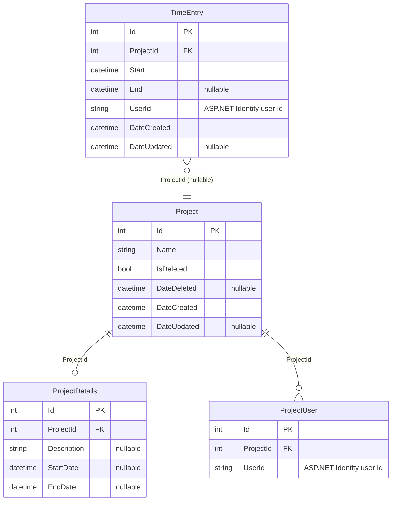
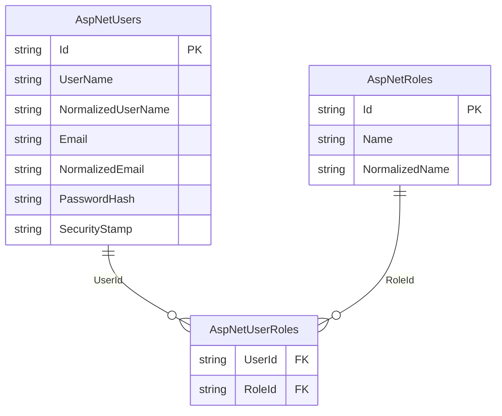

# TimeTracker — Architecture

## Overview

TimeTracker is a personal timesheeting application built to replace Clockify. It provides time entry tracking, project management, and year-view reporting for a single user.

---

## Change log

| Date | Change | PR |
|------|--------|----|
| 2026-05 | Renamed `TimeTracker.API` → `TimeTracker.Web` to align with documentation | — |
| 2026-05 | Added `TimeTracker.Tests` — 31 service integration tests (EF InMemory); CI runs `dotnet test` on every PR | #25 |
| 2026-05 | Migrated to Blazor SSR + Vertical Slice Architecture; removed `TimeTracker.Client` | #25 |
| 2026-05 | Upgraded solution from .NET 7 → .NET 10 | #20 |
| 2026-05 | Replaced Swashbuckle with native ASP.NET Core OpenAPI + Scalar UI (dev only) | #20 |

---

## Current State

### Solution structure

```
TimeTracker.sln
├── TimeTracker.Web         — ASP.NET Core + Blazor SSR + Vertical Slice features + REST API
├── TimeTracker.Shared      — EF Core entities only (class library)
└── TimeTracker.Tests       — xUnit service integration tests (EF InMemory)
```

```
TimeTracker.Web/
  Features/
    Auth/          — IAuthService, AuthService, Login/Register/Logout pages
    Projects/      — IProjectService, ProjectService, ProjectModels, ProjectEndpoints, Pages/
    TimeEntries/   — ITimeEntryService, TimeEntryService, TimeEntryModels, TimeEntryEndpoints, Pages/
  Shared/
    IUserContextService, UserContextService
    Components/    — reusable Blazor components
    Layout/        — MainLayout, NavMenu, LoginDisplay
  Data/            — TimeTrackerDataContext, IdentityDataContext
```

### Runtime

- **.NET 10**
- Single process: Blazor SSR serves pages server-side; REST API endpoints on the same host
- Runs at `https://localhost:7006` (dev). API docs at `/scalar/v1` (dev only).

### Data layer

Two EF Core `DbContext`s, both targeting **SQL Server** (`TimeTrackerDb`):

| Context | Schema | Tables |
|---------|--------|--------|
| `TimeTrackerDataContext` | `app` | `TimeEntries`, `Projects`, `ProjectDetails`, `ProjectUsers` |
| `IdentityDataContext` | `id` | ASP.NET Identity tables |

- `Project` uses soft-delete (`SoftDeleteableEntity`)
- `TimeEntry` stores `UserId` (string) rather than a navigation property to avoid cascade delete issues
- **Mapster** handles entity ↔ DTO mapping, configured via per-feature `IRegister` classes scanned at startup

### Architecture

**Vertical Slice Architecture** — no controllers, no repository layer.

- Feature services (`ITimeEntryService`, `IProjectService`, `IAuthService`) injected directly into Blazor pages and minimal API endpoints
- `IUserContextService` extracts the current user's ID from `HttpContext` claims and scopes all queries per user
- REST API endpoints registered via `MapTimeEntryEndpoints()` / `MapProjectEndpoints()` — retained for future Zoho Books integration
- DTOs live in feature-scoped `*Models.cs` files; entities are never exposed to the UI layer

### Authentication

**Cookie-based** with ASP.NET Identity (username/password, temporary — replaced by Google OAuth in Phase 4):
- HTTP-only, Secure, SameSite=Strict cookies
- 1-day expiration
- Login at `/login`, logout at `/logout`
- Local dev DB credentials via **.NET User Secrets** (`DbUser`, `DbPassword`)

### Frontend

**Blazor SSR** with:
- **Radzen.Blazor** — year-view chart (interactive server component)
- **Tailwind CSS** — utility styling
- **Microsoft.AspNetCore.Components.QuickGrid** — paginated data tables

### Infrastructure (current)

- **Hosting:** Local only — not yet deployed
- **Database:** SQL Server in Docker (port 1435)
- **CI:** GitHub Actions — `dotnet test` + CodeQL on every push/PR to `main`
- **Tests:** 31 service integration tests in `TimeTracker.Tests` (EF InMemory, no DB required)

---

## Data Model

### `app` schema



### `id` schema (ASP.NET Identity)



> `TimeEntry.UserId` and `ProjectUser.UserId` reference `AspNetUsers.Id` by convention (string foreign key). No FK constraint is defined to avoid cascade delete issues.

---

## Future State

### Goals

- Zero-cost 24x7 hosting on Azure
- Google OAuth (Gmail as login identity)
- Blazor SSR — single project, no separate WASM client
- Mobile-responsive unified UI (MudBlazor)
- Security best practices throughout

### Target architecture

```
Browser
  │
  ▼
Azure App Service F1 (free, fixed plan)
  ├── ASP.NET Core + Blazor SSR
  │     ├── Google OAuth ────────────► Google OAuth 2.0
  │     ├── Cookie auth (server-side sessions)
  │     ├── EF Core (SQL Server / Npgsql) ──► Azure SQL Database (free offer)
  │     └── Blazor SSR pages (server-rendered, interactive where needed)
  └── Automatic backups via Azure SQL (weekly full, daily differential, 5-min log)
```

### Target solution structure

```
TimeTracker.sln
├── TimeTracker.Web     — ASP.NET Core + Blazor SSR + Vertical Slice features
└── TimeTracker.Shared  — EF Core entities only
```

### Architecture principles (future)

- **Vertical Slice Architecture** — code organised by feature, not by layer
- **No MediatR** — plain feature services behind interfaces, injected directly into Blazor components and minimal API endpoints
- **No repository layer** — `DbContext` injected directly into feature services; EF Core is the repository
- **Interfaces throughout** — all services registered and consumed via interface (`AddScoped<ITimeEntryService, TimeEntryService>()`)
- **DTOs in feature folders** — entities are never exposed to the UI or API consumers; `*Models.cs` per feature holds request/response types
- **REST API retained** — minimal API endpoints alongside Blazor pages, backed by the same services, for future Zoho Books invoice integration

### Planned phases

#### Phase 2 — Local dev: SQL Server in Docker

Run SQL Server locally via Docker Desktop (Windows) to match the Azure SQL environment.

```bash
docker run \
  -e "ACCEPT_EULA=Y" \
  -e "MSSQL_SA_PASSWORD=YourStrong@Passw0rd" \
  -p 1433:1433 \
  --name timetracker-sql \
  --hostname sqlserver \
  -d mcr.microsoft.com/mssql/server:2022-latest
```

User secrets:
```bash
cd TimeTracker.Web
dotnet user-secrets set "DbUser" "sa"
dotnet user-secrets set "DbPassword" "YourStrong@Passw0rd"
```

#### Phase 3 — Blazor SSR + Vertical Slice Architecture ✅

Collapse `TimeTracker.Client` into `TimeTracker.Web`, convert to Blazor SSR, and restructure to vertical slices.

Key changes:
- Feature folders replace horizontal layers (Controllers / Services / Repositories)
- Repository layer removed — `DbContext` injected directly into feature services
- DTOs move from `TimeTracker.Shared` into feature-scoped `*Models.cs` files
- Minimal API endpoints retained per feature for future Zoho Books integration
- Pages become Blazor SSR components with direct service injection via interfaces
- Components requiring interactivity (e.g., year chart) use `@rendermode InteractiveServer`
- `AuthStateProvider`, `Blazored.LocalStorage`, `Blazored.Toast` removed

#### Phase 4 — Auth: Google OAuth + cookie auth

Replace username/password JWT with Google OAuth. HTTP-only cookie sessions replace JWT-in-localStorage.

Changes:
- Add `Microsoft.AspNetCore.Authentication.Google`
- Add cookie auth middleware
- Remove `JwtBearer`, `LoginController`, `AccountController`, `LoginService`, `AccountService`
- Keep ASP.NET Identity user table as local store (stores Google sub + email)
- On OAuth callback: find or create local user by email, sign in via cookie
- Google client ID/secret in user secrets (dev), Azure App Service config (prod)

**Security practices applied:**
- HTTP-only cookies (not accessible from JavaScript — eliminates XSS token theft)
- Secure + SameSite=Strict cookie flags
- HTTPS enforced
- CSRF protection via ASP.NET Core antiforgery (built into Blazor SSR forms)
- No sensitive credentials in `appsettings.json` or source control
- Connection strings injected via Azure App Service configuration (not environment variables visible to app logs)
- Google OAuth state parameter validated to prevent CSRF on the OAuth flow

#### Phase 5 — UI uplift: MudBlazor

Replace Tailwind + Radzen + QuickGrid with MudBlazor. Mobile-responsive by default.

Changes:
- `MudLayout` + responsive `MudNavMenu` drawer (works on phone and desktop)
- `MudDataGrid` replaces QuickGrid
- `MudDialog`, `MudTextField`, `MudSelect`, `MudDatePicker` for forms
- MudBlazor Snackbar replaces `Blazored.Toast`
- `MudChart` evaluated as replacement for `Radzen.Blazor` year chart
- Tailwind CSS removed

Can be combined with Phase 3 into a single PR since both rewrite the client layer.

#### Phase 6 — Security hardening

Applied before deployment. Covers DB connection security, app-level headers, and a pre-deployment secrets audit.

**Database — Managed Identity (no passwords):**
- App Service gets a system-assigned Managed Identity (free)
- Azure SQL gets a contained user mapped to that identity with `db_datareader` + `db_datawriter` only — no DDL rights in prod
- Production connection string has no `User Id` or `Password` — token exchange handled automatically by `Microsoft.Data.SqlClient` + `Azure.Identity`
- Local dev continues to use SQL auth against Docker SQL Server
- Azure SQL firewall restricted to Azure services only — no public internet access to port 1433
- Migrations run via privileged identity during deployment, never by the running app

**Application headers:**
- `X-Content-Type-Options: nosniff`
- `X-Frame-Options: DENY`
- `Referrer-Policy: strict-origin-when-cross-origin`
- `Content-Security-Policy`
- HSTS in production

**Rate limiting:**
- ASP.NET Core built-in rate limiting on `/auth/login` and `/auth/callback`

**Secrets audit:**
- No secrets in `appsettings.json` or source control
- JWT config removed entirely
- Google OAuth credentials only in Azure App Service config
- Production connection string credential-free

#### Phase 7 — Azure deployment + CI/CD

**Azure SQL Database:**
- Create with "Apply free offer" selected
- 32GB data storage, automatic backups (weekly full, daily differential, 5-min transaction log)
- Managed Identity auth — no credentials in connection string

**Azure App Service:**
- F1 (Free) plan — fixed plan, throttles at limit, never charges overage
- .NET 10 runtime
- System-assigned Managed Identity enabled
- HTTPS-only enforced
- Application Settings: connection string (credential-free), Google OAuth client ID + secret
- Sleep after 20 min idle — cold start on next visit (~20–30s)

**CI/CD:**
- GitHub Actions: push to `main` → build → publish → deploy to App Service
- Publish profile stored as GitHub secret

### Key package changes

| Package | Action | Reason |
|---------|--------|--------|
| `Microsoft.AspNetCore.Authentication.JwtBearer` | Remove | Replaced by cookie auth |
| `Microsoft.AspNetCore.Components.WebAssembly.Server` | Remove | No longer hosting WASM |
| `Blazored.LocalStorage` | Remove | No JWT in localStorage |
| `Blazored.Toast` | Remove | Replaced by MudBlazor Snackbar |
| `Microsoft.AspNetCore.Components.QuickGrid` | Remove | Replaced by MudDataGrid |
| `Radzen.Blazor` | Evaluate removal | Replaced by MudChart |
| — | Add | `Microsoft.AspNetCore.Authentication.Google` |
| — | Add | `MudBlazor` |

### Infrastructure (future)

| Concern | Solution | Cost | Notes |
|---------|----------|------|-------|
| Hosting | Azure App Service F1 | Free | Sleeps after 20 min idle |
| Database | Azure SQL Database free offer | Free | 32GB, automatic backups |
| Auth provider | Google OAuth 2.0 | Free | Gmail as identity |
| CI/CD | GitHub Actions | Free | Within monthly limits |
| API docs | Scalar UI (dev only) | — | `/scalar/v1` |

---

## Development setup

### Prerequisites
- .NET 10 SDK
- Docker Desktop (Windows) — for local SQL Server

### SQL Server (Docker)
```bash
docker run \
  -e "ACCEPT_EULA=Y" \
  -e "MSSQL_SA_PASSWORD=YourStrong@Passw0rd" \
  -p 1433:1433 \
  --name timetracker-sql \
  -d mcr.microsoft.com/mssql/server:2022-latest
```

### User secrets
```bash
cd TimeTracker.Web
dotnet user-secrets set "DbUser" "sa"
dotnet user-secrets set "DbPassword" "YourStrong@Passw0rd"
```

### Run
```bash
cd TimeTracker.Web
dotnet run
# App: https://localhost:7006
# API docs (dev): https://localhost:7006/scalar/v1
```

### EF Core migrations
```bash
cd TimeTracker.Web
dotnet ef migrations add <Name> --context TimeTrackerDataContext
dotnet ef migrations add <Name> --context IdentityDataContext
dotnet ef database update --context TimeTrackerDataContext
dotnet ef database update --context IdentityDataContext
```
