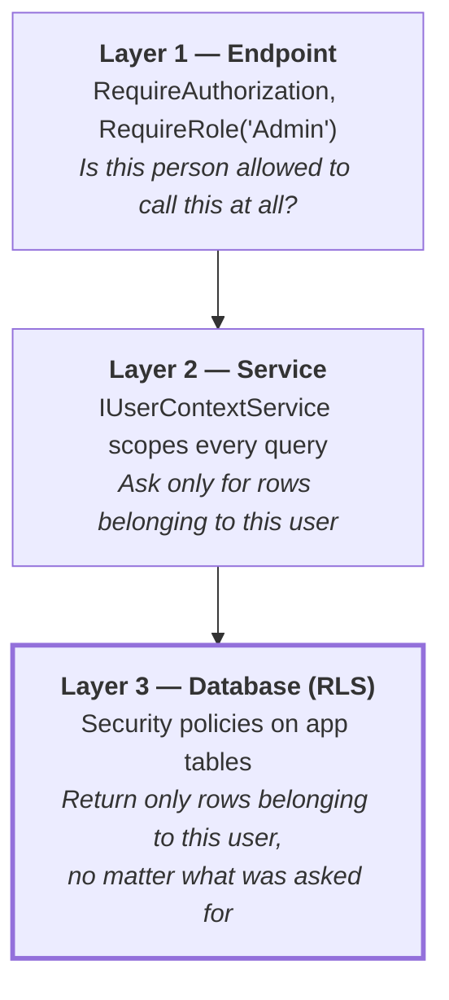
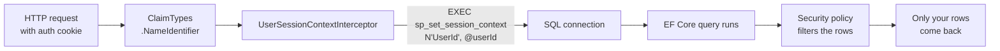
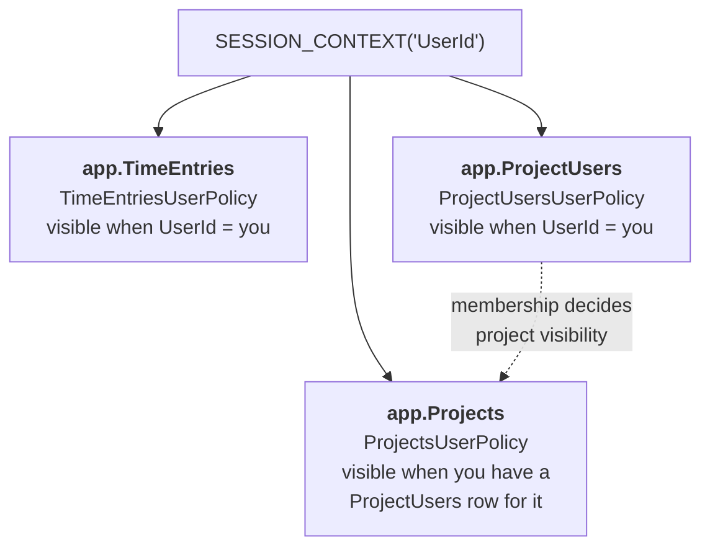
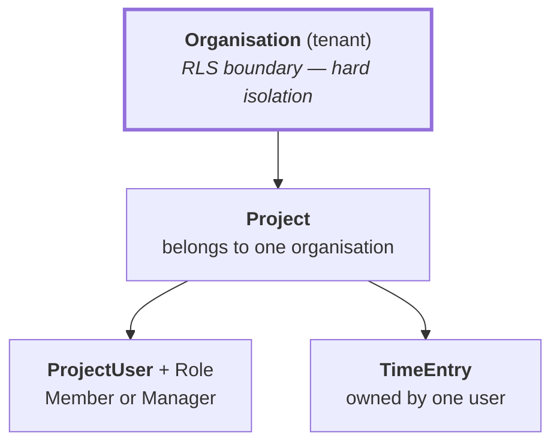

# Row-Level Security — how data isolation actually works

Plain-English reference for the RLS setup. If you only read one thing: **the database itself
refuses to return rows that aren't yours.** It does not trust the application to filter correctly.

---

## The three layers

Data isolation is defended three times. Each layer assumes the one above it might fail.



Layers 1 and 2 are ordinary application code and can be bypassed by a bug, or by any code that
talks to `DbContext` directly. Layer 3 cannot — it applies to every query on the connection,
including raw SQL. That is the whole point of it.

---

## What the database knows about "you"

RLS has no idea who is signed in. It reads one value: a per-connection variable called
`SESSION_CONTEXT`. Something has to put the user id there before every query.



`UserSessionContextInterceptor` (`TimeTracker.Web/Infrastructure/UserSessionContextInterceptor.cs`)
does this before **every** command — not just when a connection opens. That matters because
connection pooling reuses physical connections across requests without resetting
`SESSION_CONTEXT`. Set it once per connection and the next user inherits the previous user's
identity.

> Because it must be re-set per command, `sp_set_session_context`'s `@read_only = 1` option is
> unavailable here. It would prevent the value being overwritten mid-session, but it would also
> prevent the interceptor doing its job on a pooled connection.

---

## Which tables are protected, and by what rule

Three tables carry a security policy. `Clients` deliberately does not (see ADR-020).



`app.ProjectUsers` is the hinge: it is both protected in its own right *and* the lookup that
decides which projects you can see. `app.TimeEntries` is filtered directly on its own `UserId`
column — it does not go via the project.

Both rules live in inline table-valued functions, `app.fn_filter_by_user_id` and
`app.fn_filter_projects_by_user`, created in the RLS migrations under `TimeTracker.Web/Migrations/`.

---

## The one way past a policy: the `rls_bypass` role

**SQL Server does not automatically exempt `sa`, `sysadmin` or `db_owner` from RLS filter
predicates.** Microsoft's documentation is explicit: *"If a dbo user, a member of the db_owner
role, or the table owner queries a table that has a security policy defined and enabled, the rows
are filtered or blocked as defined by the security policy."* Nothing is exempt unless a predicate
says so.

This project's predicates end with:

```sql
OR IS_MEMBER('rls_bypass') = 1
```

`rls_bypass` is a database role holding **no permissions of its own**. Its entire purpose is to
satisfy that clause. Exemption is therefore something a principal is *granted* — visible,
revocable, auditable — rather than something it happens to be by virtue of being an admin.

It replaced `IS_MEMBER('db_owner')`, which had the same effect but implicitly and far too widely:
it covered `sa`, the deploy principal, and anyone who ever gained admin, with nothing to grant and
nothing to review.

Two consequences worth internalising:

- **Any new predicate function must include the clause deliberately.** Omit it and the nightly
  backup starts exporting empty tables — silently, because a `FILTER` predicate hides rows rather
  than raising an error.
- **Local development enforces RLS, exactly like production.** `sa` is no longer waved through.
  This is deliberate: it means an RLS defect is reproducible on your machine instead of appearing
  only in production.

| Principal | Used by | RLS applies? |
|---|---|---|
| `timetracker_app` (`db_datareader` + `db_datawriter`) | Local dev app runtime (ADR-035) | **Yes** |
| `sa` / `db_owner` | Local `dotnet ef` migrations only (ADR-035); ad hoc SSMS queries | **Yes** — no longer exempt |
| Managed Identity (`db_datareader` + `db_datawriter`) | Production app | **Yes** |
| Backup SP (`db_ddladmin` + `db_datareader` + `rls_bypass`) | Nightly `.bacpac` export | No — needs full rows to export |
| Migrations SP `timetracker-github-migrations` (`db_datareader` + `db_datawriter` + `db_ddladmin` + `ALTER ANY SECURITY POLICY` + `rls_bypass`) | Pipeline migrations (ADR-031) | No — a `FILTER` predicate applies to `UPDATE` too; without the bypass a future backfill would touch zero rows and report success |
| `timetracker_rls_test` (`db_datareader` + `db_datawriter`) | Container tests | **Yes** |
| `timetracker_rls_bypass_test` (+ `rls_bypass`) | Container tests | No — proves the role works |

### Break-glass access

To inspect data locally without the filter, join the role deliberately and leave again afterwards:

```sql
ALTER ROLE rls_bypass ADD MEMBER [sa];
-- ... investigate ...
ALTER ROLE rls_bypass DROP MEMBER [sa];
```

That is the point of the named role: exemption is now something you *do*, not something you *are*.

---

## Known gaps

These are real, current, and none of them are hypothetical.

**Reads are filtered; writes are not.** Every policy uses `FILTER` predicates, which hide rows on
read. Nothing at the database level stops an `INSERT` or `UPDATE` carrying another user's
`UserId`. Closing that needs `BLOCK` predicates.

**Aggregates fail silently.** A `SUM` over filtered rows does not error — it returns a *partial*
total that looks perfectly plausible. This is how the project budget bar (#167) ended up showing
one person's hours while appearing to show the project's.

**Anything team-wide is blocked by design.** Because isolation is per-user rather than per-tenant,
the database cannot express "everyone on this project". Two known casualties:

- `GetProjectUsers` returns only yourself. This used to be production-only, masked locally by `sa`
  being waved through; since the `rls_bypass` change it reproduces on a dev machine too.
- A project budget cannot roll up the team's hours.

**Data migrations need the bypass.** A `FILTER` predicate applies to `UPDATE` as well as `SELECT`.
A migration connection sets no `SESSION_CONTEXT`, so unless its principal is in `rls_bypass`, an
`UPDATE` over a protected table touches **zero rows, reports success, and raises no error**. Any
backfill against `TimeEntries`, `Projects` or `ProjectUsers` must run under the bypass, and should
assert its own completeness rather than trusting the row count. This is concretely satisfied as of
ADR-031: the pipeline migrations principal (`timetracker-github-migrations`) is a member of
`rls_bypass`, so this is no longer a hypothetical gap for any migration run through the deploy
pipeline — it only remains a risk if migrations are ever run ad hoc through a different principal.

**`SESSION_CONTEXT` is only as trustworthy as the app tier.** The application asserts who the user
is; the database believes it. RLS defends against a bug in the query layer, not against a
compromised application.

---

## Where this is heading

> **Status: proposed, not implemented.** The design below is unverified — `RlsPredicateSpike`
> in `TimeTracker.Tests/Infrastructure/` exists to test these assumptions against a real SQL
> Server before anything is committed. Do not treat this section as fact.

The intended direction adds an Organisation tier above projects, which changes what RLS is *for*:
the tenant boundary, rather than per-user isolation. Per-user and per-project visibility then
becomes application-tier authorization — the split commercial time trackers use.



Under that model:

| Table | Filtered by |
|---|---|
| `app.Projects` | the organisation you belong to |
| `app.TimeEntries` | your own rows, **or** rows on a project you manage |

A Manager role on `ProjectUser` is what unlocks the team rollup a project budget needs, without
giving every member sight of colleagues' timesheets — matching how Harvest separates Administrator,
Project Manager and Member.

Open questions the spike must answer before this is designed properly: whether a predicate on
`app.ProjectUsers` may query `app.ProjectUsers`, whether nested policies break the manager lookup,
whether `BLOCK` predicates behave as expected, and whether the membership policy should simply be
dropped.

---

## Related

- `docs/decisions.md` — ADR-020 (RLS + audit trail), ADR-023 (single-tenant), ADR-028 (Testcontainers), ADR-031 (pipeline migrations)
- `docs/architecture.md` — schema diagrams
- `TimeTracker.Tests/Infrastructure/RlsIntegrationTests.cs` — proves the policies work
- `TimeTracker.Tests/Infrastructure/RlsPredicateSpike.cs` — throwaway; answers the open questions
